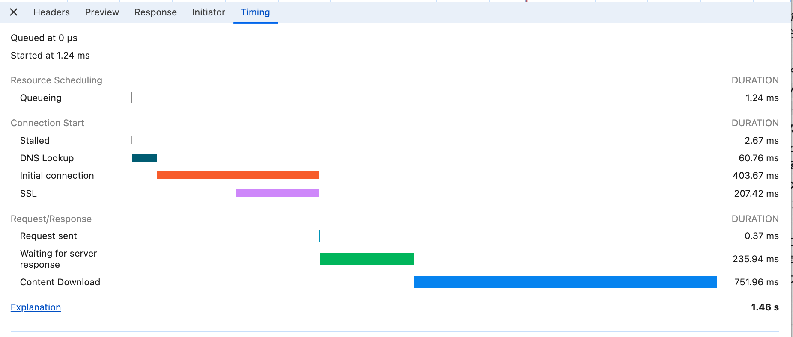
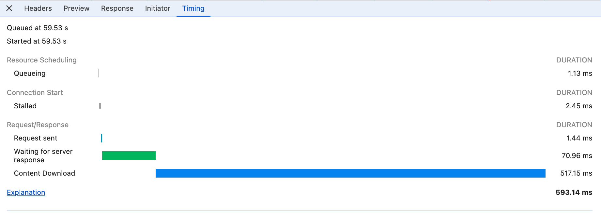

# CDN(CloudFront)について理解して使ってみよう

## 課題 1

### なぜ CDN を使うと WEB サーバの負荷分散や WEB サービスのパフォーマンス改善につながるのでしょうか？

CDN を使うことでコンテンツをクライアントから一番近いエッジローケーションにキャッシュできます。
エッジサーバーからキャッシュを返答することでレイテンシーを最小限、コンテンツがホストされているオリジンサーバーへの負荷を低下し、
突発的なトラフィックの上昇に対しても分散型ネットーワークであるため負荷分散の役割も果たします。

### CDN におけるオリジンサーバとエッジサーバの違いは何でしょうか？

| 項目           | オリジンサーバー                   | エッジサーバー                             |
| -------------- | ---------------------------------- | ------------------------------------------ |
| 役割           | 元のコンテンツをホストする         | ユーザーに近い場所からキャッシュを配信する |
| 配置場所       | 限られた拠点                       | 世界中のエッジロケーション s               |
| トラフィック   | 通常は直接トラフィックを処理しない | ユーザーの大部分のトラフィックを処理       |
| 負荷の分散     | 分散はされていない s               | 分散されている                             |
| レスポンス速度 | 地理的距離があるため遅い場合がある | ユーザーに近いため速い                     |

### ブラウザキャッシュと比較したとき CDN にはどのような利点があるのでしょうか？ ブラウザキャッシュがあるにも関わらず CDN を使った方がよいのは、どんな時でしょうか？

#### エッジサーバーにキャッシュすることでユーザーの初回訪問時からレスポンスを高速化する

一方でブラウザキャッシュのみ使用すると必ずオリジンサーバーがアクセスを捌く必要がある。
CDN であれば、他のユーザーがアクセスしていればエッジサーバーにコンテンツがキャッシュされているのでそこから返却される可能性が存在する。

#### オリジンサーバーの負荷を軽減しアクセスのスパイクに備えることができる

CDN は分散型ネットワークなのでキャンペーンから起因するアクセススパイクを分散できるが、
ブラウザキャッシュは必ずオリジンサーバーが初訪問時はリクエストをハンドリングする必要がある。

#### ブラウザキャッシュと違いコンテンツ更新を柔軟に行える

CDN は任意のタイミングでキャッシュを無効化できる

## 課題 2

### 実際に CDN を使って画像へのアクセスを改善してみましょう

#### S3 から画像を取得した時と、CloudFront 経由で画像を取得した際、リクエスト/レスポンスの所要時間を比較してみましょう

結論: CloudFront が S3 より高速にレスポンスを返している。

S3 の場合

CloudFront の場合

