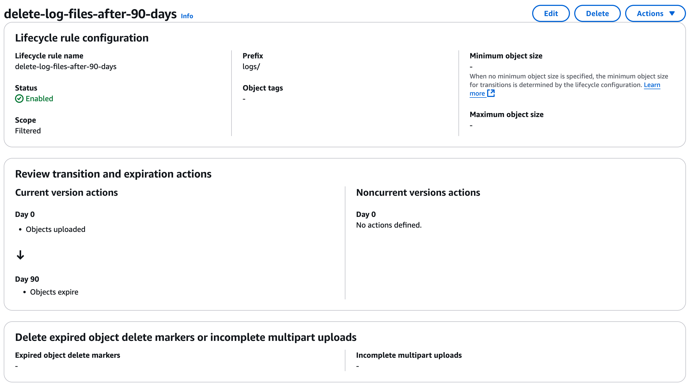
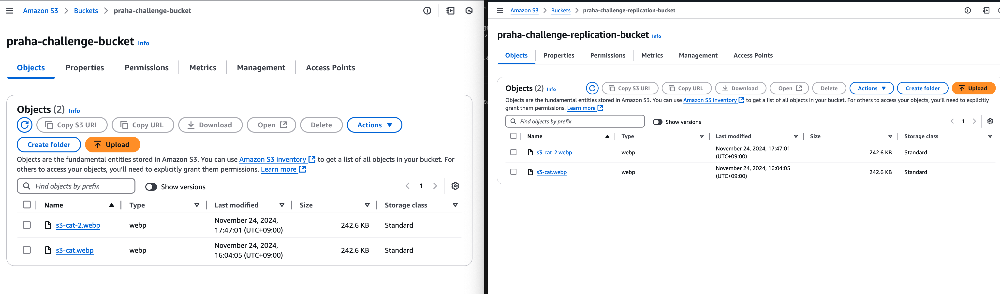
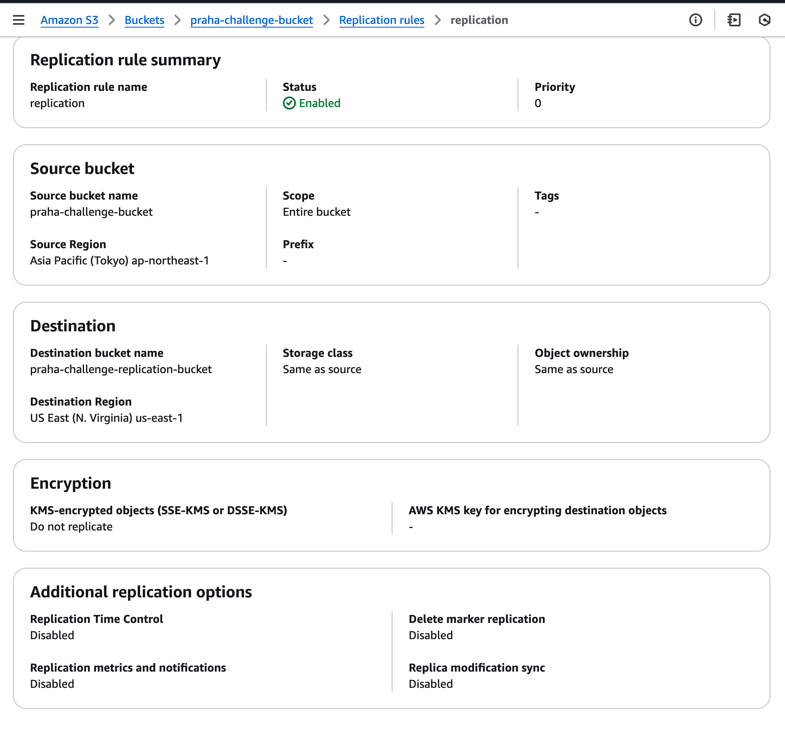
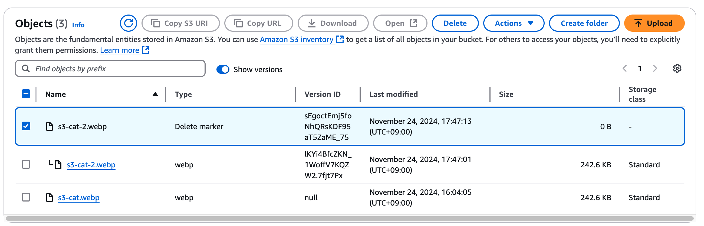

# S3 を理解する

## 課題 1 (ストレージクラス)

### ストレージクラス

#### どのような時に、どのストレージクラスを選択するべきでしょうか？

| ストレージクラス              | 対象                                                                                                                |
| ----------------------------- | ------------------------------------------------------------------------------------------------------------------- |
| S3 Standard                   | 1 か月に複数回アクセスされるデータ（ミリ秒単位でのアクセス）                                                        |
| S3 Standard – IA              | 長期間保存される、月に 1 回程度しかアクセスされないデータ（ミリ秒単位のアクセス）                                   |
| S3 Intelligent-Tiering        | アクセスパターンが不明、変動的、または予測不可能なデータ                                                            |
| S3 One Zone-IA                | 再生成可能で、月に 1 回程度の頻度でアクセスされるデータを、ミリ秒単位の低遅延で取得可能                             |
| S3 Express One Zone           | 単一の AWS アベイラビリティゾーン内で、レイテンシーに敏感なアプリケーション向けに、1 桁ミリ秒のデータアクセスを実現 |
| S3 Glacier Instant Retrieval  | 長期間保存され、四半期に 1 回程度アクセスされるアーカイブデータをミリ秒単位の低遅延で取得可能                       |
| S3 Glacier Flexible Retrieval | 長期間保存され、年に 1 回程度アクセスされるアーカイブデータを数分から数時間の取得時間                               |
| S3 Glacier Deep Archive       | 年に 1 回未満の頻度でアクセスされる長期保存アーカイブデータを数時間の取得時間                                       |
| RRS (非推奨)                  | 重要度が低く、頻繁にアクセスされるデータを、ミリ秒単位の低遅延で取得可能                                            |

#### ほとんどアクセスされないバケットを作成する場合はどのストレージクラスの選定が良いでしょうか？

ほとんどがどの程度の頻度なのか分かりませんが、月一回のアクセスですぐにデータが必要なのであれば S3 Standard - IA が最適です。
さらにレイテンシーに敏感なサービスが使用するのであれば S3 Express One Zone、一方て頻度であれば S3 Glacier 等を検討すると良いでしょう。

### ライフサイクル

#### ライフサイクルとはなんでしょうか

S3 ライフサイクル設定では、ライフサイクルルールを使用して、オブジェクトの存続期間中に Amazon S3 が実行するアクションを定義します。例えば、オブジェクトを別のストレージクラスに移行したり、オブジェクトをアーカイブしたり、指定した期間後にオブジェクトを期限切れ (削除) したりするルールを定義できます。

#### (先輩からの依頼)作成から 30 日経ったら、もっと安いストレージクラスに移動するようにしておいて！一応監査のために取っておく必要があるんだよね。

上記の仕様を満たすようなライフサイクルを画像オブジェクトに設定してみましょう。
IT 監査は四半期に一回あると想定すると、S3 Glacier Instant Retrieval が 30 日後に最適なストレージクラス

#### (先輩からの依頼)ログを作成から 90 日経ったら自動的に消えるようにしておいて！

## 課題 2(バックアップ)

#### S3 における「バージョニング」と「レプリケーション」の違いは何でしょうか？

| **機能**             | **バージョニング**                                                                       | **レプリケーション**                                                                                                         |
| -------------------- | ---------------------------------------------------------------------------------------- | ---------------------------------------------------------------------------------------------------------------------------- |
| **目的**             | オブジェクトの履歴管理。変更や削除が発生しても、過去のバージョンを保持し復元可能にする。 | オブジェクトを他のバケットに自動コピーしてデータの冗長性や可用性を向上させる。                                               |
| **対象範囲**         | 1 つのバケット内で有効。                                                                 | 元のバケットとコピー先のバケットの間で動作。クロスリージョン（異なる AWS リージョン）や同一リージョン内で設定可能。          |
| **主なユースケース** | 誤った削除や上書きからのデータ保護。過去バージョンの復元が必要な場合。                   | データの冗長性確保や復旧。複数リージョンでデータの可用性を高めたい場合。                                                     |
| **復元機能**         | 削除されたファイルや過去のバージョンを復元可能。                                         | レプリケーションされたデータはコピー先に存在するが、元のデータが削除されるとコピー先も削除される（削除ルールの設定による）。 |

#### レプリケーション

#### バージョニング

**Delete Marker**はオブジェクトのメタデータで、作成されるとオブジェクトの最新バージョンとして使われ、ユーザーにはオブジェクトが削除されたように見えます。つまり Delete Marker を削除すると過去バージョンが閲覧可能になります。

