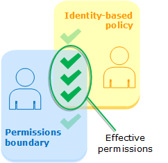

# 安全な IAM の設計を理解する

## 課題１

### 以下の用語を説明してください：

- IAM ユーザ

  - IAM ユーザーは、AWS アカウント で作成したエンティティです。IAM ユーザーは、IAM ユーザーを使用して AWS リソースとやりとりする人間のユーザーまたはワークロードを表します。IAM ユーザーは名前と認証情報で構成されます。

- IAM グループ

  - IAM ユーザーグループとは、IAM ユーザーの集合です。ユーザーグループを使用すると、複数のユーザーに対してアクセス許可を指定でき、それらのユーザーのアクセス許可を容易に管理することができます。

- IAM ポリシー

  - AWS でのアクセスを管理するには、ポリシーを作成し、IAM アイデンティティ (ユーザー、ユーザーのグループ、ロール) または AWS リソースにアタッチします。ポリシーは AWS のオブジェクトであり、アイデンティティやリソースに関連付けて、これらのアクセス許可を定義します。

- IAM ロール

  - ロールを使用して、通常は AWS リソースへのアクセス権のないユーザー、アプリケーション、サービスにそのアクセス権を委任できます。

- Permission boundary（アクセス許可境界）

  - Permissions Policy と Permissions Boundary の両方で許可されているものが有効なアクセス権限ということになります。想定されるのは、Permissions Boundary では、制限したいアクセス権を広く定義しつつ、Permissions Policy の方でユーザやロールごとに、付与したいアクセス権限を細かく管理するイメージになると思います。

    

- AWS 管理ポリシー、カスタマー管理ポリシー

  - AWS 管理ポリシーは、AWS が作成および管理するスタンドアロンポリシーです。スタンドアロンポリシーとは、ポリシー名が含まれている独自の Amazon リソースネーム (ARN) の付いたポリシーです。
  - カスタマー管理ポリシーは、プリンシパルエンティティ (IAM グループ、IAM ロール) にアタッチできる単独のポリシーを独自の AWS アカウント に作成することができます。これらのカスタマー管理ポリシーは、特定のユースケースに合わせて作成し、何度でも変更および更新が可能です。

- ホワイトリストパターン、ブラックリストパターン
  - ホワイトリストパターン
    - 明示的に許可を記述していないアクションについては暗黙的に拒否
  - ブラックリストパターン
    - 明示的にポリシーを拒否(Deny)する
    - 本ポリシーで権限の範囲を絞って明示的許可ポリシーでアクションを許可する
      - 該当するアクションの権限は他のポリシーにより上書きすることができなくなります

## 課題２

### 管理者権限を持った IAM ユーザを作成してみましょう

#### 質問：なぜ毎回ルートユーザとしてアクセスするのではなく、管理者権限の IAM ユーザでログインした方が良いのでしょうか？

ルートユーザーは最も強い権限を持っているため、乗っ取りの際にどのような操作もできてしまうため、ルートしかできない操作以外は IAM ユーザーを使って行う。

##### ルートユーザーでしかできないこと

[ルートユーザー認証情報が必要なタスク](https://docs.aws.amazon.com/ja_jp/IAM/latest/UserGuide/id_root-user.html#root-user-tasks)

#### 質問：ひとつの IAM ユーザーを使い回すことにはどのような問題があるでしょうか？

1. 監査・追跡が困難になる - 誰がいつどの操作を行ったかトラッキングができなくなる
2. 責任の曖昧さ - トラッキングができないので、問題が発生した際に修正が困難になる
3. セキュリティリスクの増大 - 認証情報が共有されるので漏洩リスクが高まる
4. 多要素認証（MFA）の効果が減少 - 同じ MFA を複数の人が所持している状態になり MFA の意味がなくなる
5. 管理が煩雑になる - 情報(パスワードなど)が更新された際の連絡が煩雑になる

### PowerUserAccess ポリシーを付与した IAM ユーザを作成してください

#### PowerUserAccess と非常に似たポリシーのように見えますが、この 2 つのポリシーは何が違うのでしょうか？

PowerUserAccess: AWS サービスとリソースへのフルアクセスを提供しますが、ユーザーとグループの管理は許可しません。

#### 「AWS 管理ポリシー」と「カスタマー管理ポリシー」これらはどのように使い分けると良いのでしょうか？

- AWS 管理ポリシーは、一般的なアクセス権限をすばやく設定したいときや、特別なカスタマイズが不要な場合
- 特定のリソースに対してきめ細かい権限を設定したい場合や、独自のセキュリティ要件やコンプライアンス要件に合わせたポリシーを作りたい

### Administrators という名前のグループを作成

#### AdministratorAccess ポリシーを直接ユーザに付与する方法と、グループに付与してユーザを所属させる方法があります。どのような理由で、どちらの方が適切だと感じますか？

結論: グループを使って管理する方が適切

- 管理の一貫性の向上と煩雑さの排除
- 権限管理の柔軟性と運用の効率化
- ポリシーのメンテナンスや監査が容易

### EC2 から S3 にアクセスできるような IAM 設定

仕様に合った IAM ロールの作成方法:

1. IAM policy で特定の S3 バケットにアクセスできるポリシーを作成
2. EC2 にアタッチする IAM ロールを作成する
3. EC2 に作成したロールをアタッチする

作成したポリシー(これのみをロールに追加)

```
{
    "Version": "2012-10-17",
    "Statement": [
        {
            "Sid": "VisualEditor0",
            "Effect": "Allow",
            "Action": "s3:ListBucket",
            "Resource": "arn:aws:s3:::praha-iam-s3"
        }
    ]
}
```

#### EC2 インスタンスにロールを付与するべきか直接ポリシーを付与するべきか

結論: ロールに付与するのが適切

- アクセス管理の一貫性を維持できる
- 一時的な認証情報の利用 -> ロールを使うと、一時的なセキュリティトークンが発行され恒久的に必要なキーが必要なくなる

#### IAM には「Resource based」と「Identity based」ポリシーがあります。どのような違いがあるのでしょうか？どのような時にどちらを使うべきなのでしょうか？

- アイデンティティベースのポリシーは、IAM ユーザー、グループ、ロールなど IAM エンティティにアタッチされます。これらのポリシーを使用すると、そのアイデンティティが実行できる内容 (そのアクセス許可) を指定できます。
- リソースレベルのアクセス許可とは、ユーザーがアクションを実行できるリソースを指定できる機能を意味します。

- アイデンティティベースポリシーを使うのが一般的です。ユーザーやロールに直接権限を与えることで、リソースへのアクセスを制御します。リソースベースポリシーは、リソース側で特定のアカウントやエンティティからのアクセスを明示的に許可する必要がある場合に使います(S3 バケット等)。

#### S3 を意図しないアクセスから守るため IAM 以外に設定しておいた方が良い項目はないでしょうか？

- パブリックアクセスをブロックする
- バケットポリシーを設定し特定の IP アドレスや VPC からしか受け付けないように制限する
- アクセスログを有効にする

### 設計方針

#### 「ホワイトリスト方式」「ブラックリスト方式」のメリットデメリット

- ホワイトリスト方式
  - セキュリティを重視し、必要なアクセスのみを明示的に許可する方式です。セキュリティが高く、最小権限の原則に沿いますが、管理に手間がかかることがあります。
- ブラックリスト方式
  - デフォルトでアクセスを許可しつつ、特定の危険なアクションやユーザーのみを拒否する方式です。管理が簡単で柔軟ですが、セキュリティリスクが高く、脅威を見逃す可能性があります。

PostgreSQL の RLS（Row Level Security）はホワイトリスト方式に近い設計です。なぜならデフォルトでアクセス拒否をし、許可ベースのアクセス制御を行っているからです。

#### 何か AWS でリソースに対するルールの自動チェックを行ってくれるサービスは用意されていないか

- AWS Config
  - AWS リソースの設定履歴
  - ソフトウェアの設定履歴
  - リソース間の関係の追跡
  - マルチアカウント、マルチリージョンでのデータ集約
  - etc.

## 課題３

#### IAM に関するクイズを作成してください

1. 複数のポリシーが同じリソースに対して明示的に異なる allow・deny を設定している場合、最終的に適用はどうなりますか。

   1. 拒否されます(例:AdministratorAccess を与えて、特定の s3 バケットへのアクセスを deny する)

2. STS（Security Token Service）を使って発行された一時的なセキュリティ認証情報は、次のどのケースに適していますか？
   1. 一時的な認証情報は、ID フェデレーション、委任、クロスアカウントアクセス、および IAM ロールが使用されるシナリオで便利です。
