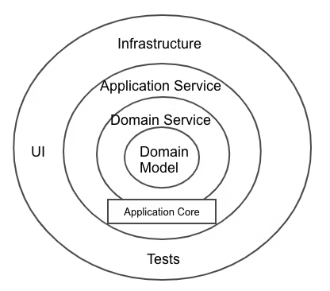

# オニオンアーキテクチャを学ぶ

## 課題 1

### オニオンアーキテクチャを図解してください

オニオンアーキテクチャとは中心のドメインモデルを軸に、関心の分離を促進し、アプリケーションの柔軟性やテスト性を向上させることを目的としています。

#### ドメインモデル

役割:
他の層に依存せずビジネスロジックに関連した状態と振る舞いをするオブジェクト

具体例:

- Entity -> ロジックに関わるオブジェクト(User や Order など)
- Value object -> 普遍な値オブジェクト(Money, Address など)

#### ドメインサービス

役割:
ドメインモデル単体では表現しずらいビジネスロジックを提供する。複数の Entity や Value object の操作を必要とするロジックを扱います。

具体例:

- ビジネスロジック -> 在庫チェック(Inventory Service)

#### インフラストラクチャ

役割: DB への保存や外部システムとの通信など、技術的な詳細を提供する。このレイヤーはドメインモデルに依存するが、ドメインモデルから直接参照されることはない。

具体例:

- データベース -> レポジトリパターンを使用してドメインオブジェクトを永続化
- 外部サービス -> API クライアント(支払いサービスなど)

#### ユーザインターフェース

役割:
ユーザーや外部システムと直接やり取りをする。ドメインモデルやインフラ層を呼び出す。

具体例:

- API -> REST や GraphQL エンドポイント
- UI -> フロントエンドアプリケーション

参考: [オニオンアーキテクチャとは何か](https://qiita.com/cocoa-maemae/items/e3f2eabbe0877c2af8d0)

### 中心に位置するドメインモデル層は他のどの層にも依存していません。こうすることに、どのようなメリットがあるのでしょうか？

- 他の層に依存しないので、他の層の変更による影響を受けにくく、システムの保守性や拡張性が向上する。
- 業務ロジックを中心とした設計になるため、エンジニア以外のステークホルダーにも挙動の理解が得やすくなる。
- ドメインモデルを独立させることで再利用性が高まり、異なるアプリケーションやコンテキストでも適用できる。
- 他の層と疎結合であるため、ユニットテストが容易になり、効率的に品質を担保できる。
- 一般的なアーキテクチャパターンを採用しているため、学習リソースが豊富で、開発者が理解しやすく、学習コストを低減できる。

### 層をまたいで依存関係が発生する時（例えばユースケース層がレポジトリ層のメソッドを呼び出す時など）はインターフェースに対する依存のみ許可します。こうすることに、どのようなメリットがあるのでしょうか？

- 依存性の逆転によるモジュール間の結合度が下がる。
  - インターフェースが肯定されていればユースケース層のコードを変更する必要がない
- テスト用意性の向上
  - 外部依存をモック化することができる
- 関心の分離
  - ユースケース層はアプリケーションのビジネスロジックに集中して、データアクセスの具体的な実装に依存しない
- 特定のプラットフォームや技術スタックへの依存が軽減される

### 「依存性の逆転」がオニオンアーキテクチャにおいてどのように使われているのか説明してください

玉ねぎ内側の依存させるために依存性の逆転を使う。内側のユースケース層は、外側のレポジトリ層に直接依存せず、間にあるインターフェースを実装することで内側の要求を満たす。こうすると外部実装が内側に影響を与えることがなくなります。

### 特定のユーザにしかリソースの追加や更新を許さないようなアクセス制限機能を実装したいとします。どの層に記述するのが適切でしょうか？

アクセス制限はリソースへの許可を判断するビジネスルールであるため、ドメインサービス層(ビジネスロジック)に記述しアプリケーション全体で一貫性を維持できる。

### データベースを MySQL から PostgreSQL に変更するとします。どの層を変更する必要があるでしょうか？

データベース接続の実装部分を中心に変更が必要になります。

1. 接続情報の変更
2. リポジトリの実装(クエリを MySQL から PostgreSQL に変更する)
3. ORM やデータベースドライバの変更

## 課題 2

### オニオンアーキテクチャに関するクイズを作成してください

#### 質問: オニオンアーキテクチャにおいて、ドメインモデルが外部のインフラストラクチャ層と直接的にやり取りを行うことが問題となる理由はなんでしょうか。

回答: ドメインモデルがインフラストラクチャ層の実装に影響を受ける

#### 質問: オニオンアーキテクチャにおけるデータアクセス（リポジトリパターン）の役割を説明してください。

回答: ドメインモデルが依存しない形で永続化の詳細を隠蔽する

#### 質問: オニオンアーキテクチャでは、外部インフラストラクチャ層の実装をドメイン層に提供するために、どのような設計手法を用いるべきですか？

回答: インターフェースを使用して依存性の逆転を用いる
