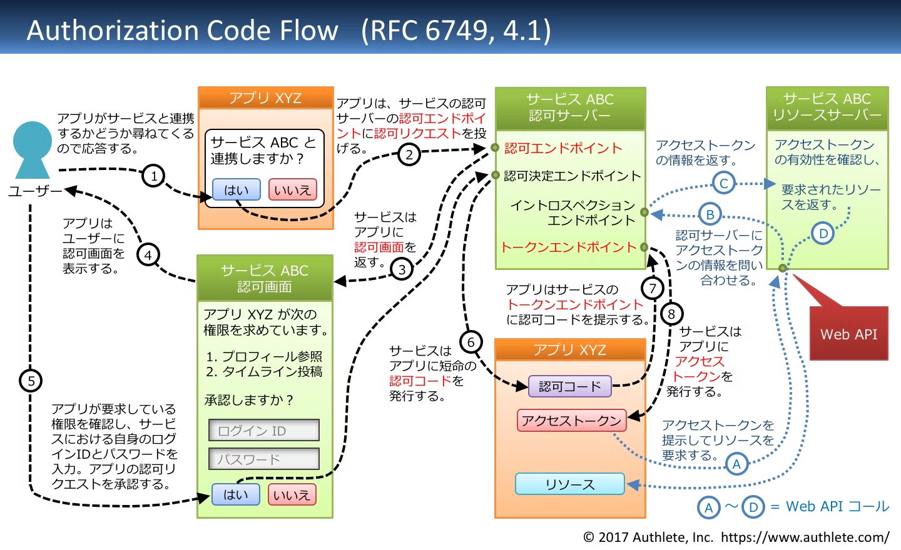
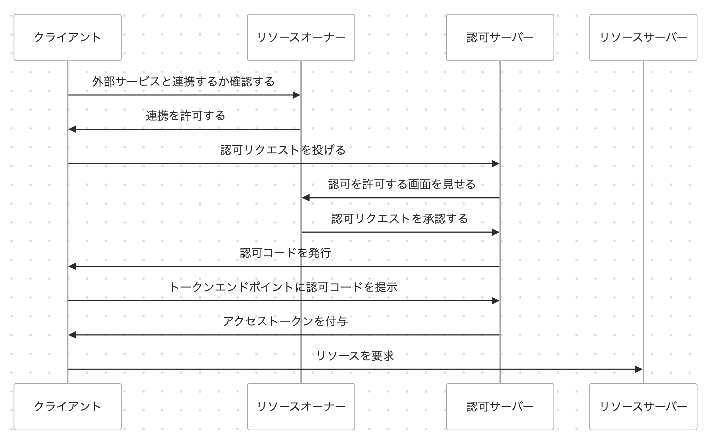
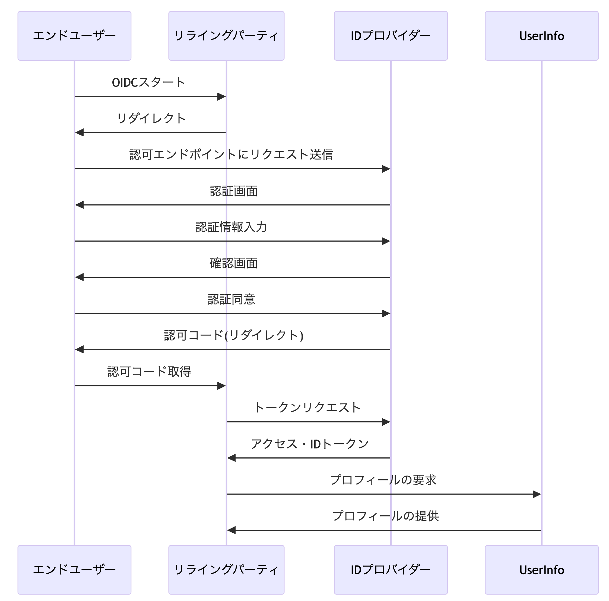

# ログイン機能を実装してみよう

## 課題 1

### 「認証」と「認可」の違いを説明してください。

認証はユーザーの身元を確認することであるのに対し、認可はユーザーのリソースにアクセする権利を与えることです。

- 認証は、ネットワーク、アカウント、アプリケーション、システムやその他のリソースへのアクセスを許可する前に、ユーザーの身元を確認するプロセスです。
- 認可は、データ、アプリケーション、ネットワークなどのシステムリソースに対するユーザーのアクセスレベルを決定するプロセスです。

[認証と認可：その違いは？](https://www.keepersecurity.com/blog/ja/2023/12/26/authentication-vs-authorization-whats-the-difference/#:~:text=%E8%AA%8D%E8%A8%BC%E3%81%A8%E8%AA%8D%E5%8F%AF%E3%81%AE%E4%B8%BB,%E5%B0%8E%E5%85%A5%E3%81%99%E3%82%8B%E5%BF%85%E8%A6%81%E3%81%8C%E3%81%82%E3%82%8A%E3%81%BE%E3%81%99%E3%80%82)

### なぜ OAuth2.0 を「認証」の仕組みと呼んではいけないのでしょうか？

OAuth2.0 は認可プロトコルであって認証プロトコルではない。API サーバーやユーザーデータといったリソースセットへのアクセス権限の付与をする手段として設計させれています。
OAuth2.0 は「ユーザーが特定のリソースにアクセスする権限があるか」を確認するのに対して、認証は「ユーザーが誰であるか」を確認することに焦点を置いている。
認証を行うためのプロトコルは、OpenID Connect などがあり、これは OAuth2.0 に認証機能を追加したものになります。

[OAuth 2.0 とは？](https://auth0.com/jp/intro-to-iam/what-is-oauth-2)

### OAuth2.0 の仕組みを図で説明してください。

#### リソースオーナー　

保護されたリソースを所有し、アクセス権限を与えることができるユーザーまたはシステム。

#### クライアント

保護されたリソースへのアクセスを要求するシステム。

#### 認可サーバー

クライアントからのアクセストークンのリクエストを受信し、認証が成功してリソースオーナーからの合意を得たらアクセストークンを発行する。

#### リソースサーバー

ユーザーのリソースを保護しクライアントからのアクセスを受信するサーバー。

クライアントが認可アクセストークンを得るまでのステップ

1. クライアントは必要なパラメターを付与して認可サーバーへリダイレクトさせる
2. リソースオーナーに対して要求されている認可を許可して良いかを確認する
3. 認可サーバーは認可コードを発行してクライアントにリダイレクトする
4. リダイレクト時に付与された認可コードを認可サーバーに渡してアクセストークンを取得する
5. アクセストークンを使用してリソースにアクセスする

[参考: OAuth 2.0 全フローの図解と動画(Qiita)](https://qiita.com/TakahikoKawasaki/items/200951e5b5929f840a1f)

### 「認可コードグラント」について、シーケンス図と流れの説明を書いてみてください。

### OAuth2.0（特に認可コードグラント）の仕組みを説明するうえで必ず登場するであろう次のワードについて、それぞれ説明してください。

#### アクセストークン

リソースサーバーにアクセスするために必要なトークン。

#### リフレッシュトークン

アクセストークンの有効期限が切れた際に新しいアクセストークンを取得するためのトークン。アクセストークンは短命なため、リフレッシュトークンを使用して新しいアクセストークンを取得します。
また、リフレッシュトークン自体も有効期限がありますが、アクセストークンよりも長い期間有効です。

#### 認可コード

認可サーバーからクライアントに送られる一時的なコード。ユーザーが認可サーバーで認証しクライアントに対してアクセス許可を与えると認可コードがクライアントに返却されます。
クライアントは認可コードを使用してトークンエンドポイントからアクセストークンを取得します。

#### 認可エンドポイント

リソースオーナーがクライアントアプリケーションに対してアクセス許可を与えるためのアクセスする URL。ユーザーが許可を与えると認可エンドポイントは認可コードをクライアントに返します。

#### トークンエンドポイント

クライアントが認可コードを使用してアクセストークンやリフレッシュトークンを取得するための URL。

#### リダイレクトエンドポイント

認可サーバーがユーザーの認可を受けた後にクライアントに認可コードやエラーを返すために使用する URL。クライアントは事前に認可サーバーにリダイレクトエンドポイントを指定しており、認可サーバーはユーザー認証後、このエンドポイントに認可コードやエラー情報をリダイレクトする。

### OIDC の認可コードフローについて、シーケンス図と流れの説明を書いてみてください。

OpenID Connect を使った認証フロー

1. ユーザーがクライアントにログインする。
2. クライアントは認証サーバーに認証リクエストを送信する。
3. 認証サーバーはユーザーに認証ページを表示する。
4. ユーザーは認証情報を入力し認証サーバーに送信する。
5. 認証サーバーはユーザーを認証し認証成功後に認可コードをクライアントの指定のリダイレクト URL にリダイレクトする。
6. 認証コードを受け取ったクライアントは認証サーバーにトークンリクエストを送信する。
7. 認証サーバーはリクエストを確認し ID トークンをクライアントに返却する。
8. クライアントは ID トークンを受け取りユーザーの認証状態を確認する。

[OpenID Connect について勉強したのでまとめる](https://zenn.dev/bonvoyage/articles/5dda6a1effd022)

### OAuth2.0 と OIDC の差分を見たときに登場する、次の 2 つの要素について説明してください

#### ID トークン

誰がなんのために発行し、どのように利用されるのか

- ID プロバイダが発行する
- ユーザーが正しく認証されたことを証明するために利用させる
- トークンを検証して認証状態を確認し、ユーザー情報を取得する

どのような形式で、どんな情報が含まれているのか

- JWT 形式で発行され、ヘッダー、ペイロード、署名から構成される
- 含まれる情報
  - iss(Issuer):ID プロバイダの識別子
  - sub(Subject): ユーザーの識別子
  - aud(Audience): リライングパーティの識別子
  - exp(Expiration Time): 有効期限
  - iat(Issued At): 発行日時
  - auth_time: ユーザーが認証された時間
  - nonce: ナンス(セキュリティ用のランダムな値)

ID トークンによる認証は、OAuth による認証と比べて何が優れているのか

- OAuth は認可に焦点を当てており、ユーザーの認証に関する情報を持っていない。
- ID トークンは認証情報も提供するためユーザー情報も直接取得することができる。

アクセストークンとの役割の違いはなにか

- アクセストークンを使ってリソースサーバーにアクセするが、トークンにはユーザーの認証情報は含まれていない。
- ID トークンを使用することで、認証情報を直接取得できる。

#### UserInfo エンドポイント

どのタイミングでなんの目的で利用されるのか

- リライングパーティが ID トークンからは取得できなかったユーザーの名前やメールアドレスなどの詳細情報を取得するために使用する。
- 基本的には ID トークンに含まれていない情報を取得するために使う。
