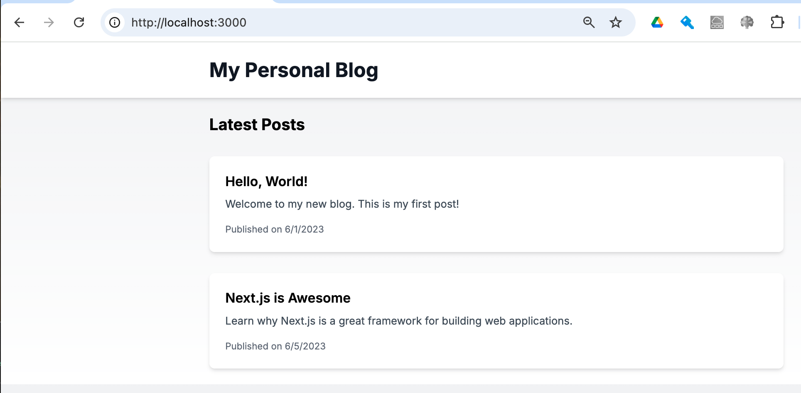

# MVP 用フロントエンドを実装してみよう

## 課題 1

V0 で NextJS のブログサイトを出力して、MSW で API をモッキング

## 課題 2

### Next.js や React Router の CLI を使って生成した開発の雛形を、内容を理解せずそのまま使い続けてしまって困る場面をいくつか考えてみてください。

- ローカル環境で動作する最低必要限の設定になっている
  - ビルド時間などパフォーマンスが最適化されていない
  - 各環境に合わせた環境変数を適切に設定する
- セキュリティに関する考慮はないので本番環境にはすぐにデプロイできない
  - インフラや非機能要件に合わせたビルド作成することがデフォルトだとできない
- デフォルトの設定ファイルの理解不足によるトラブルシューティングが困難になる

### Chakra UI など、最初から見栄えが整っているコンポーネントライブラリを使って MVP を作り、それをそのまま本番に流用した場合、将来的に起こる可能性がある問題をいくつか考えてみてください。

- 色の変更などは使用しているライブラリの制約に依存するので柔軟性と拡張性が下がる
- 別プロジェクトやシステムで別のライブラリを使っていると将来的にどちらかに統一する可能性がある
  - 継続して使用する場合エンジニアの学習コストが上がる(技術スタック全体との統合性)
- MVP が成長しカスタム機能や独自ロジックを追加するのであれば実装難易度が上がる

### 課題 1-1, 課題 1-2 でそれぞれあなたが選んだライブラリやフレームワークについて、なぜそのフレームワークを選んだのか、チームで情報共有してみてください。

課題 1-1, 課題 1-2 では任意課題で言及されている v0 で作成、これは生成 AI を使ったフロントエンド生成で自動で以下の技術スタックが選ばれました。最速で仮説検証が必要とされる MVP では、一般的なスタックであれば問題ありません。

- Next.js
- Tailwind
