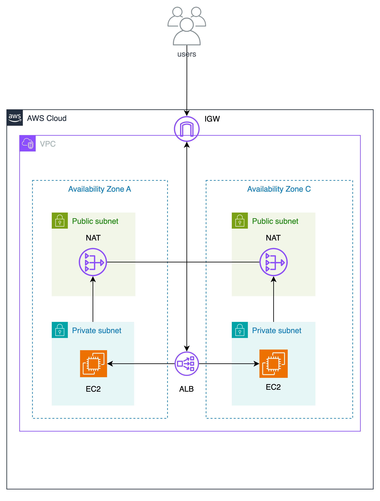

# 冗長化された Web アプリケーションを作ってみよう

## 課題１

### 冗長化された Web アプリケーションを作ってみよう

#### 構築した構成



#### ALB の A レコードにブラウザからアクセスして、先ほど設置したページが表示されるか確認してください。

確認完了!

```
❯ curl url.ap-northeast-1.elb.amazonaws.com
<!DOCTYPE html>
<html lang="en">
<head>
    <meta charset="UTF-8">
    <meta name="viewport" content="width=device-width, initial-scale=1.0">
    <title>Private Subnet A</title>
</head>
<body>
    <h1>From Private Subnet A</h1>
</body>
</html>

❯ curl url.ap-northeast-1.elb.amazonaws.com
<!DOCTYPE html>
<html lang="en">
<head>
    <meta charset="UTF-8">
    <meta name="viewport" content="width=device-width, initial-scale=1.0">
    <title>Private Subnet C</title>
</head>
<body>
    <h1>From Private Subnet C</h1>
</body>
</html>

❯ curl url.ap-northeast-1.elb.amazonaws.com
<!DOCTYPE html>
<html lang="en">
<head>
    <meta charset="UTF-8">
    <meta name="viewport" content="width=device-width, initial-scale=1.0">
    <title>Private Subnet A</title>
</head>
<body>
    <h1>From Private Subnet A</h1>
</body>
</html>
```

#### 片方の EC2 インスタンスを停止して、再度 ALB の A レコードにアクセスしてください

確認完了!
