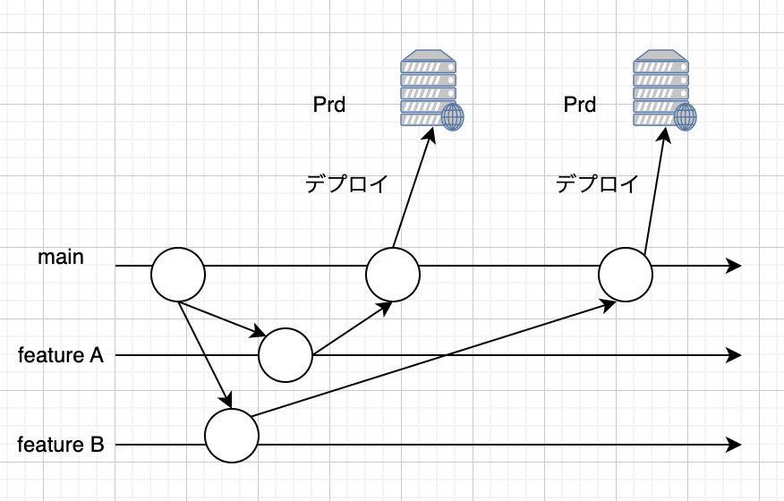
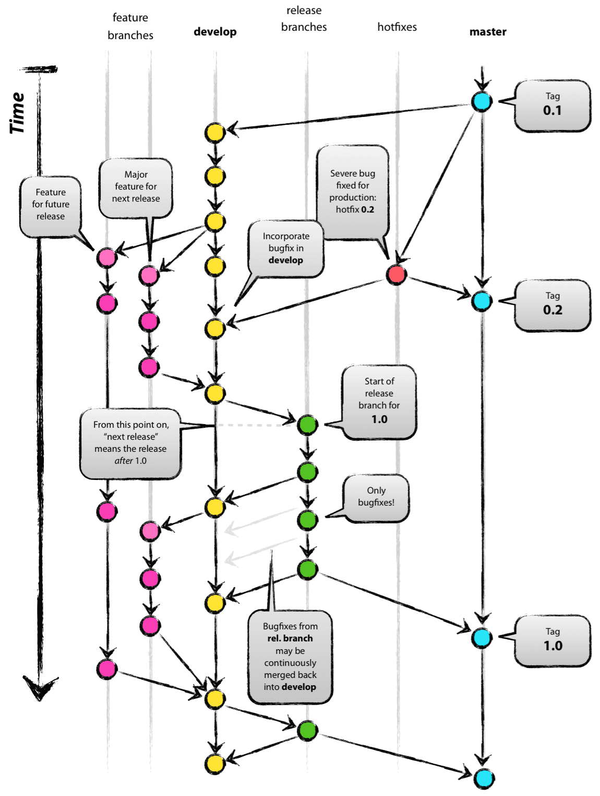

# ブランチ戦略を学ぼう

## 課題１（質問）

### GitHub Flow

#### 概要

- main ブランチと feature ブランチで開発を行う
- feature ブランチで開発が完了すると main ブランチにマージされ、このマージされた内容が本番環境へリリースされる
- main ブランチは常にデプロイ可能なソースコードが格納されている

### Gitflow

- main
  - リリースするソースコードを管理するブランチ
  - タグでバージョンを管理する
- develop
  - 実際に開発を行うブランチ
  - バグ修正もマージされる
  - 新しい機能は feature ブランチを作成して開発
- feature
  - develop ブランチから分岐するブランチ
  - 新しい機能を開発する
  - 開発が終わったら develop ブランチにマージする
- release
  - develop ブランチから分岐するブランチ
  - リリース直前にバグ修正などの微調整、つまり QA を行うブランチ
  - QA を完了したら、main, develop ブランチにマージ
- hotfix
  - リリースされたバージョンで発生したバグを速やかに修正するブラン
  - 修正後すぐ master, develop ブランチにマージ

### Gitflow と GitHub flow、それぞれどのようなメリット/デメリットがありそうでしょうか？

- Gitflow
  - メリット
    - 整理されたワークフロー: 複数のブランチがあり、それぞれの役割が明確なので、特定のフェーズ（新機能開発、リリース準備、バグ修正）ごとのコード管理がしやすい。
  - デメリット
    - ブランチが多く複雑: ブランチの数が増えるため、管理が複雑になりやすい。特に小規模なプロジェクトや頻繁にデプロイを行うプロジェクトには過剰になる可能性がある。
    - 習熟が必要: 使い慣れていないチームメンバーにとって、ルールを理解し適応するまでに時間がかかる。
- GitHub flow
  - メリット
    - シンプルでスピード重視: ブランチの構成がシンプルで、常にデプロイ可能な状態を保ちながら開発を進められるため、特に継続的デリバリー（CD）を行う場合に有効。
    - 短期間の開発や小規模チームに最適: 小規模なプロジェクトや短期間での開発には、シンプルなワークフローが効率的。
    - レビューサイクルが短い: プルリクエストごとにコードレビューを行うため、問題の早期発見が可能。
  - デメリット
    - 複雑なリリース管理に不向き: リリースブランチがないため、複数のリリースを並行して準備したり、過去のバージョンに対するホットフィックスを適用するのが難しい。
    - 大規模プロジェクトでの柔軟性不足: 長期的なリリース計画や多くのステークホルダーがいるプロジェクトには、Gitflow のようなリリースの管理がしづらい。

### トランクベースと呼ばれる管理手法もあります。それぞれどのようなメリット/デメリットがありそうでしょうか？

概要: トランクベース開発管理手法は main ブランチに細かくコミットをしていく

- メリット
  - commit のサイクルが短いため、リリース頻度を上げることができる
  - 1commit の変更量が少ないため main ブランチが壊れる可能性が低く、原因特定が容易
  - タスクが小さいため達成感を得ることができる
- デメリット
  - タスクを細かく切り分けるにはコードベースの理解度に左右されそう。見積もりが甘ければトランクベース開発が推奨している数時間分のタスクに切り分けられない
  - 複数人で別々のユーザーストリーに取り組む場合は、CI を回す時に別機能のコミットが混ざってしまう可能性がある(原因把握が大変になる)

どういうケースで使うか?

- 大きなプロジェクトで複数開発者が同時作業する中で機能の分離をはかる際はブランチベースのアプローチを取ります。一方迅速な変更が必要であれトランクベース管理手法をベースにします。
