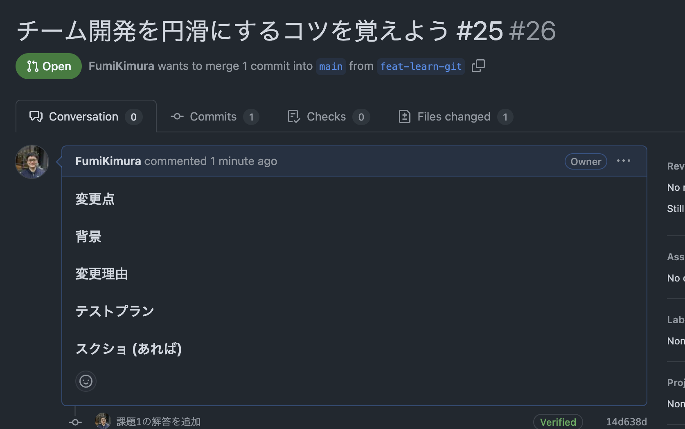

# チーム開発を円滑にするコツを覚えよう

## 課題1（質問）

### PR（プルリクエスト）は小さく提出することが良しとされる現場が多い傾向にあります。何故でしょうか？

1. レビューが最も必要な部分とそうでない部分を理解することができる
2. 認知負荷(理解しやすい)が少なくて済むので、見逃しを発生しづらくなる
3. 変更を切り戻し(ロールバック)を細かくすることができる(各PRがCIのテストなど問題ない前提)
4. 小さいPRでもマージされやすいので達成感を得やすい(開発ライフサイクルのスピード向上)
5. マージコンフリクトを避けやすい

### コードのコメントに書くべきこと、 書くべきではないことを挙げて、ペアと議論してみてください
- 書くべきこと
    1. あるコードが存在するのがなぜかという理由 (why) を説明している
- 書くべきではないこと
    1. コードが何をしているのか (what) を説明するようなものであってはいけない(コード自体をシンプルにするべき)

### Gitなどのコミットコメントに書くべきこと、書くべきではないことを挙げて、ペアと議論してみてください
- 書くべきこと
    1. 変更内容を簡潔に説明
    2. なぜ変更が必要だったのかの理由
    3. チケットやIssueの番号
    4. 変更の影響範囲
- 書くべきでないこと
    1. 無意味なメッセージと説明(test, WIPなど)

## 課題2（実装）

### GitHubのPRやIssueにテンプレートを設定する機能があります。実際に作ってみましょう！

```
### 変更点

何を変えたか？

### 背景

変更を加える上での背景

### 変更理由

なぜ変更を加えたのか

### テストプラン

テストプラン

### スクショ (あれば)
```


## 課題3

### チーム開発を円滑にするために上記以外に効果のありそうな取り組みを探しください
