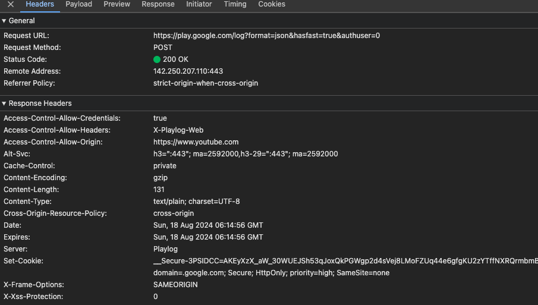
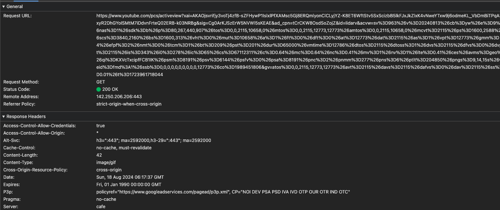
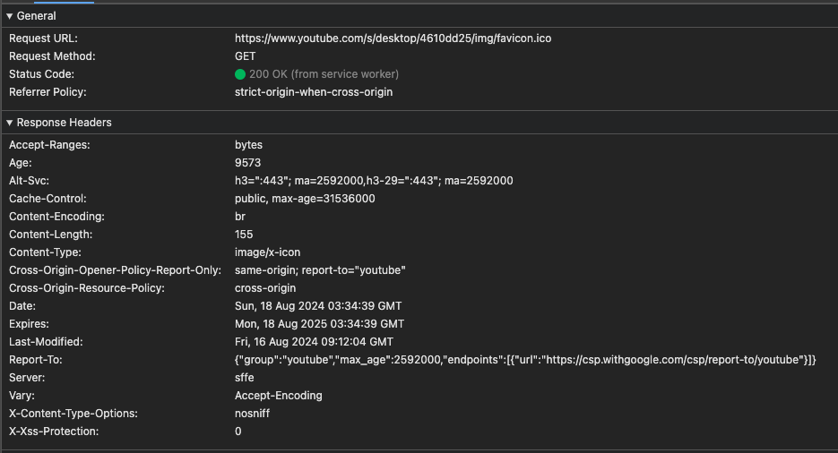

## キャッシュについて理解する

### 課題 1

#### なぜキャッシュが必要なのか、説明してください

キャッシングとは、データが頻繁に変わらない場合に、そのデータを元のソースから再取得することなく、一時的に別のストレージに保存しておく行為です。こうすることで頻繁に使用されるデータの取得速度が上がり、システムの処理速度が向上します。また元ソースへの負荷を軽減することができ、システムがより多くのリクエストを処理できるようになります。

#### キャッシュヒット率とは何でしょうか？どのように向上できるでしょうか？

キャッシュヒット率は、キャッシュヒット数をキャッシュヒット数とキャッシュミス数の合計で割ったものです。

1. キャッシュヒット = サーバーがキャッシュを使用してリクエストにレスポンスを返すことができたケース
2. キャッシュミス = サーバーがキャッシュを使用せずにリクエストにレスポンスを返したケース

#### キャッシュには様々な種類があります。いくつか例を挙げてそれぞれのキャッシュの違いを説明してください

- CPUキャッシュ
    - L1、L2メモリなどCPU内部に組み込まれた超高速なメモリで、CPUが頻繁にアクセスするデータや命令を保持します。

- ブラウザキャッシュ
    - WebブラウザがWebページやリソース(画像、CSSファイル)を一時的に保存しておくキャッシュです。

- プロキシキャッシュ
    - プロキシサーバーに一時的に保存しておくキャッシュです。
    - クライアントとオリジンサーバーの間に立っているサーバーでリクエストのレスポンスが保存されていればオリジンサーバーへリクエストを流さずに返信します。

- データベースキャッシュ(インメモリキャッシュ)
    - アプリケーションサーバーとデータベースの間に立つキャッシュサーバー
    - Redisなどのインメモリデータストアを利用してデータベースクエリ結果やセッション情報をキャッシュします。

#### HTTP通信における、ブラウザがキャッシュを制御するために存在するヘッダーを3つ以上挙げる

1. Cache-Control
    ```
    一番使われているブラウザキャッシュをコントロールするヘッダー
    キャッシュをブラウザや共有キャッシュ(プロキシサーバーやCDN)において制御するためのディレクティブ(指示)を指定することができます。
    ```
   
2. Etag
    ```
    ブラウザにてコンテンツ(画像やCSS)に対するハッシュ値を保存し最新コンテンツのリクエスト時に添える。
    ハッシュ値を受け取ったサーバーは最新コンテンツのハッシュ値と比較して更新を確認、差異があればコンテンツを返送する。
    ```

3. Clear-Site-Data
    ```
    サーバー側からブラウザ内のサイトデータを明示的に消去するヘッダー
    サーバーが返信する際に、ブラウザが関連つけられた閲覧用データ(クッキー、ストレージ、キャッシュ)を消去します。
    ```

#### ブラウザのキャッシュサイズの上限は、ユーザが自由に変更できます。

参考ページ: [ブラウザーのストレージ制限と削除基準](https://developer.mozilla.org/ja/docs/Web/API/Storage_API/Storage_quotas_and_eviction_criteria)

1. キャッシュサイズの上限

    2つのモード:
    1. ベストエフォート
        - 既定の方法でデータが保存されます。
        - この方法で保存されたデータは、以下の条件が満たされている限り保持されます:
            - オリジン（データの出どころ）が割り当てられたストレージクォータ（容量制限）を超えていない。
            - ユーザーのデバイスに十分なストレージ空間がある。
            - ユーザーがブラウザーの設定でデータの削除を選択しない。
        - これらの条件が満たされない場合、ブラウザーはデータを削除する可能性があります。
    2. 永続モード
        - オリジンがこの方法を選択することで、データを永続的に保存することができます。
        - このように保存されたデータは、ユーザーがブラウザー設定で削除を選択しない限り削除されません。

    FireFox
    ```
    ベストエフォートモードでオリジンが使用できる最大ストレージ空間は、以下のいずれか小さい方です。

    1. ユーザーのプロファイルが格納されるディスク総容量の 10%。
    2. 10GiB は Firefox が同じ eTLD+1 ドメインに属するすべてのオリジンに適用するグループ制限です。
    
    永続的ストレージが許可されているオリジンは、総ディスクサイズの 50% （上限 8 TiB）まで格納することができ、eTLD+1 グループの制限を受けません。
    ```

    Chrome/Microsoft Edge(Chromiumオープンソースプロジェクトに基づくブラウザ)
    ```
    オリジンは永続モードとベストエフォートモードの両方で、
    総ディスクサイズの 60% まで格納することができます。
    ```

    Safari 
    ```
    オリジンには最初に 1GiB のクォータが指定されます。
    オリジンがこの制限に達すると、 Safari はユーザーに、オリジンがさらにデータを格納するためにその権限を要求します。
    これはベストエフォートモードと永続モードの両方で発生します。
    ```

2. キャッシュサイズの上限を超えた場合

    オリジンがクォータを使い切った場合はどうなるか。
    ```
    オリジンのクォータ(容量)を超えて格納しようとすると、
    QuotaExceededError 例外が発生して失敗します。   
    ```

    ブラウザが利用できる最大容量を超えてしまった場合、
    - LRU(Least Recently Used)ポリシーを使用しオリジンデータを消去します。
    - 永続的でないオリジンのみに適用されます。


#### マイページをキャッシュする際にExpireを使用する

- Expireヘッダー
    - レスポンスが古くなると見なされる日時が入ります。

1. なぜ動的なサイトではexpiresは使わないのでしょうか？
    動的なサイトは更新頻度が多いのでExpireでキャッシュを設定した場合、ユーザーは古いコンテンツを見続けることになります。

2. なぜ今時あまり使われないのでしょうか？
    Expireヘッダーは日時で有効期限を指定するため柔軟性が欠け、現在はCache-Controlヘッダーが主流になっている。
    Cache-Controlヘッダーは、max-ageディレクティブやno-cacheを使用して細かい制御ができるようになっています。

3. どう対応すれば良いのでしょうか？
    1. `Cache-Control: max-age=3600, must-revalidate`を使用してキャッシュがフレッシュ(古くなる)でなくなれば、再利用する前にオリジンサーバーで再利用する。
    2. EtagやLast-Modifiedを使用してサーバーに対してキャッシュが有効なのかを確認するようにする。


#### ブラウザのキャッシュがWEBサービスに用いられている実例を、3つ以上見つけて共有してください。

`Cache-Control: private`と`Expire`がレスポンスヘッダーに付与されている。

目的: URL(https://play.google.com/log?format....)から察するにログをPOSTするエンドポイントなので、
CDN(プロキシーサーバー)にキャッシュを許さず、またExpireをレスポンス生成時に設定することですぐに古いキャッシュにmust-revalidateで再検証させている。


`Cache-Control: no-cache, must-revalidate`と
`Expires: Fri, 01 Jan 1990 00:00:00 GMT`を設定している。

目的: Expireを過去に設定することでキャッシュの再利用前にオリジンサーバーに再検証を必ず行うようにし、最新データを常に取得している。


`Cache-Control: public, max-age=31536000`、
`Date: Sun, 18 Aug 2024 06:14:56 GMT`
`Expires: Sun, 18 Aug 2025 06:14:56 GMT`、
`Last-Modified: Fri, 16 Aug 2024 09:12:04 GMT`が設定されている。

目的: 1年間はブラウザ(public, max-age=31536000)およびプロキシサーバーにfaviconをキャッシュさせる。
キャッシュが古くなれば(フレッシュではなくなる)、last-modifiedヘッダーを使い再検証を行っている。


### 課題2 (実装)

`./server`を確認してください。

### 課題3 (成果物に関する質問)

- どんなサービスの？
    - 金融サービス -> 個人情報や財務データを扱うサイト
    - 医療関係のサービス -> 患者の健康情報や診断結果を取り扱うサイト
- どんなページで？
    - ログインページやユーザ認証のページ
    - 動的に生成されるユーザー情報が含まれているページ(個別のダッシュボードなど)
- どんなファイルを？
    - 認証情報をキャッシュする
    - 一時的に生成される個人情報が含まれたファイルなど(個人の画像やビデオファイルなど)
    
### 課題4 (クイズ)
1. `Cache-Control: max-age=0, must-revalidate`はどんな挙動をしますか。
- 解答: サーバーに新しいリクエストを送信し、リソースが変更されていなければキャッシュを再利用する

2. `stale-while-revalidate`と`stale-if-error`について説明してください。
- 解答: 
    1. `stale-while-revalidate` -> キャッシュを再検証している間、古いレスポンスの再利用が可能なことを示します。
    2. `stale-if-error` -> オリジンサーバーがエラー（500、502、503、504）でレスポンスを返したときに、キャッシュが古いレスポンスを再利用できることを指示します。