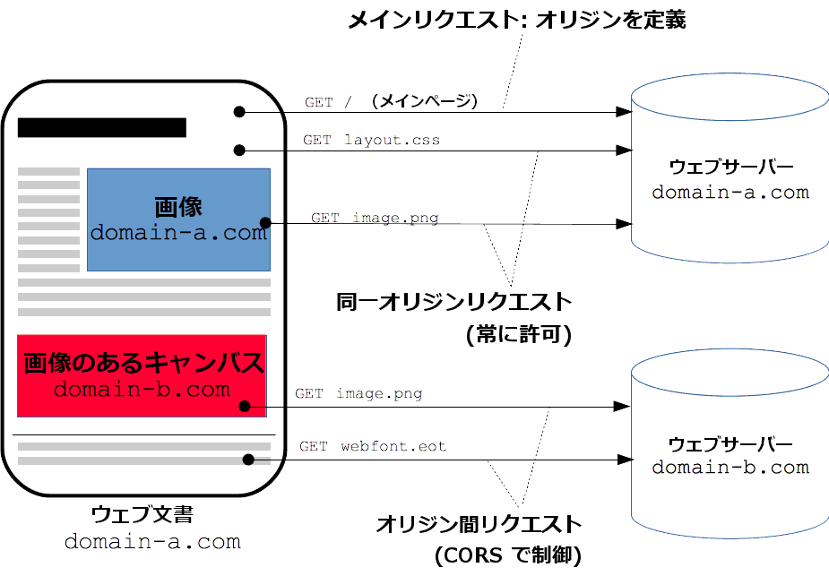

## CORS について理解する

### 課題 1

#### 以下の単語を使って CORS の仕組みを説明してください

- preflight request
- simple request
- access-control-allow-origin

概要: オリジン間リソース共有 (Cross-Origin Resource Sharing, CORS)は、追加の HTTP ヘッダーを使用して、あるオリジンで動作しているウェブアプリケーションに、異なるオリジンにある選択されたリソースへのアクセス権を与えるようにブラウザに指示するための仕組みです。つまり、これらの API を使用するウェブアプリケーションは、そのアプリケーションが読み込まれたのと同じオリジンに対してのみリソースのリクエストを行うことができ、それ以外のオリジンからの場合は正しい CORS ヘッダーを含んでいることが必要です。



参考記事: [オリジン間リソース共有 (CORS)](https://developer.mozilla.org/ja/docs/Web/HTTP/CORS)

##### CORS の仕組み

1.  ユーザーがアクションを起こして JS コードが別オリジンにあるサーバーへリクエストを送信します

2.  ここで条件により送信されるリクエストが変化します

    - シンプルリクエストの場合

      1. シンプルリクエストはプリフライトリクエストを必要とせずに直接サーバーへ送信するリクエストです(以下の条件を満たす)

         - 使用する HTTP メソットが GET, POST, HEAD のいずれかである
         - 利用する HTTP ヘッダーが特定の標準ヘッダー(例: Accept, Content-Type など)のみである

           ```
           Accept
           Accept-Language
           Content-Language
           Content-Type
           application/x-www-form-urlencoded
           multipart/form-data
           text/plain
           ```

      2. サーバーはリクエストを受け取り、適切な Access-Control-Allow-Origin ヘッダーを含めたレスポンスを返します

- プリフライトチェックの場合

  1. ブラウザはまずプリフライトリクエストを送信します。これは OPTIONS メソッドを使用します
     サーバーが許可されたメソッドやヘッダーを示すレスポンスを返します。

     ```
       OPTIONS /api/data HTTP/1.1
       Host: api.example.com
       Origin: http://example.com
       Access-Control-Request-Method: PUT
       Access-Control-Request-Headers: Content-Type
     ```

  2. ブラウザはサーバーのレスポンスを確認し、リクエストが許可されている場合は、実際のリクエストを送信します

     ```
         PUT /api/data HTTP/1.1
         Host: api.example.com
         Origin: http://example.com
         Content-Type: application/json
         { "data": "new example data" }
     ```

  3. サーバーはリクエストを処理し適切なレスポンスを返却します

#### Access-Control-Allow-Origin: "\*"

概要: どのオリジンに対してもリソースを共有するという意味
機密データを扱っているサービスの場合、信頼できるオリジンのみを指定することで、セキュリティリスクを低減させることができる。

#### preflight request が送信されない「シンプルなリクエスト」に該当するための条件を説明してください

- 使用する HTTP メソットが GET, POST, HEAD のいずれかである
- 利用する HTTP ヘッダーが特定の標準ヘッダー(例: Accept, Content-Type など)のみである

  ```
  Accept
  Accept-Language
  Content-Language
  Content-Type
  application/x-www-form-urlencoded
  multipart/form-data
  text/plain
  ```

- リクエストにカスタムヘッダーが含まれていない。

#### シンプルなリクエストの場合は preflight リクエストが送信されず、そのままリクエストがサーバに到達します。サーバからのレスポンスの Access-Control-Allow-Origin ヘッダーに、リクエスト送信元のオリジンが含まれない場合、ブラウザはどのような挙動を取るでしょうか？

送信元から送られたリクエストは処理されるが、クロスドメインであるため、ブラウザではレスポンスをブロックします。具体的には JS のコードからレスポンス内容にアクセスすることを禁止します。またコンソール上に下記のようなエラーメッセージを表示します。

```
Access to XMLHttpRequest at 'how to be something new' from origin 'http://example.com' has been blocked by CORS policy: No 'Access-Control-Allow-Origin' header is present on the requested resource.
```

#### HTML の a タグを辿って異なるオリジンに移動する際は、特に CORS 制約は発生しません。なぜでしょうか？

リンク、リダイレクト、フォーム提出などは異なるオリジンへの書き込みといい、同一ポリシー内では許可されています。

参考記事: [同一オリジンポリシー](https://developer.mozilla.org/ja/docs/Web/Security/Same-origin_policy)

#### XMLHttpRequest を使ってクロスオリジンリクエストを発行する際、デフォルトの挙動だとリクエストにクッキーが含まれません。クッキー情報を含むためには、何をする必要があるでしょうか？

クライアント側とサーバー側で実装を変更しヘッダーの内容を変更する必要がある。

クライアント側の実装:

```
const xhr = new XMLHttpRequest();
xhr.withCredentials = true; // ここを追加。
```

サーバー側の実装:
オリジンを明示的に設定し(\*はダメ) Access-Control-Allow-Credential を追加する必要がある。

```
Access-Control-Allow-Origin: https://example.com
Access-Control-Allow-Credentials: true
```

### 課題 2

CORS に関するクイズを作成してください

1. CORS ポリシーにおいて、Access-Control-Max-Age ヘッダーの役割は何かを説明してください。また、その最大値はいくらですか？
   解答: Access-Control-Max-Age は事前リクエストのキャッシュ期間を示しています。ヘッダーの最大値は 86400 秒(24 時間)です。
2. クライアントが Origin: http://sub.example.comでリクエストを送信し、サーバーがAccess-Control-Allow-Origin: http://example.comで応答する。このリクエストは成功しますか。
   解答: オリジンが一致しないため、ブラウザはレスポンスをブロックする。

### 課題 3

`./server`のモックサーバーを確認して下さい。

### 課題 4

果たして CURL からのリクエストを受けた時、CORS 制約は適用されるでしょうか？ その理由を説明してください。

Curl はコマンドラインツールであるため CORS 制約は適用されない。CORS 制約はブラウザが実行する JS のセキュリティ機能です。
