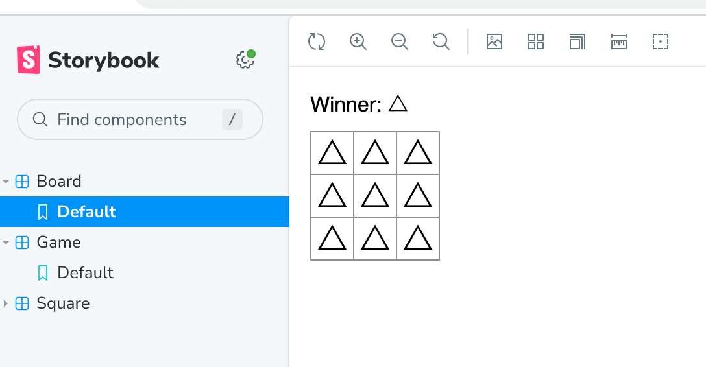

## storybookを作ろう

### 課題1（実装）
`/src/components`を確認してください。

### 課題2（実装）
`/src/stories`を確認してください。盤面を△で埋め尽くしました。

### 課題3（質問）

メリット
1. すべてのコンポーネントの挙動・崩れなどを確認できる
2. 開発中のコンポーネントの正しさを検証(テスト)でき開発速度が上がる
3. コンポーネントの全体管理ができ、不必要なものゼロから作って時間を無駄にするリスクが減る

デメリット
1. 学習コストがあり、慣れるまでに時間がかかる
2. ストーリーが巨大になった際に管理が大変そう
3. フロントエンド管理の上にStorybookの管理が追加される

### 課題4（クイズ）
1. StorybookのレポジトリからFeature Requestを一つピックアップし概要を説明してください。
2. Storybookを代替できるプロダクトを3つあげてください。
3. Storybookのaddonsとはなんでしょうか。