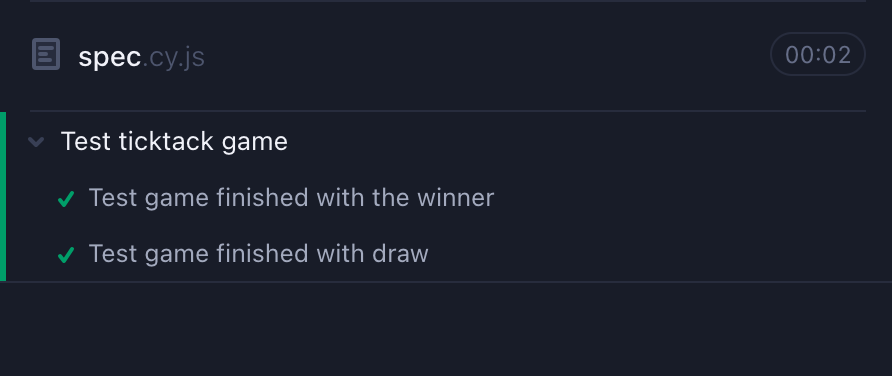
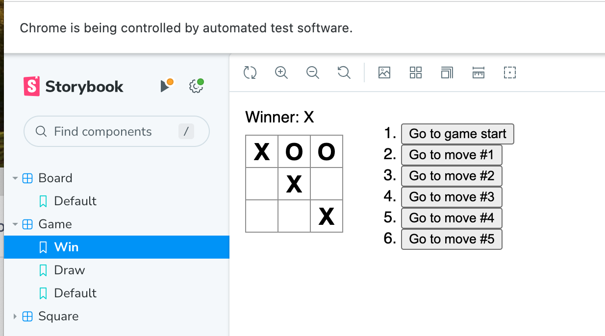
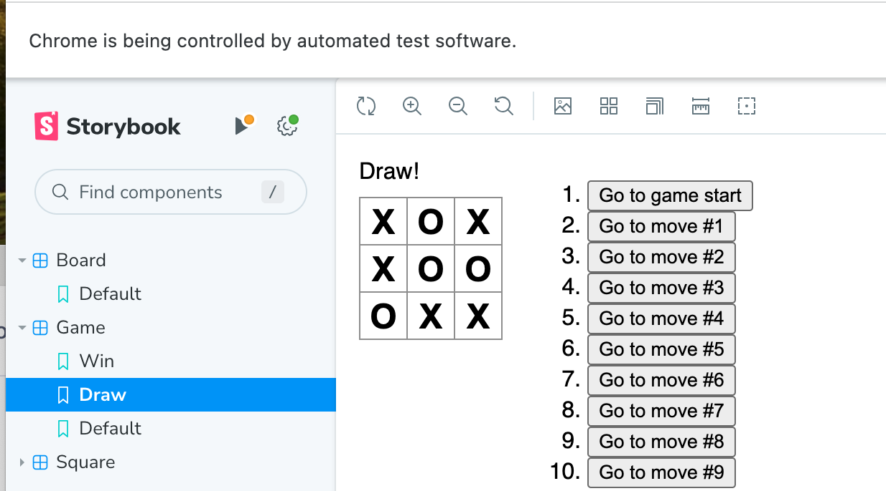

# E2E テストを書こう

## 課題 1（実装）

### 下記の手順で確認できます。

1. サーバーをスタートする
   `$ npm start`
2. cypress をスタートする
   `$ npm run cy-open`
3. e2e テストを開始する

### テスト結果:

### Storybook の更新

## 課題 2（質問）

### E2E テストのメリットとデメリットを挙げてください

#### メリット

- ユーザー目線で挙動をテストすることができる
- 最初から最後までビジネスロジックが問題なく動いているか検証できる
  - バグを減らし品質を向上させる(信頼性の向上)
- 実際に使うデバイスに近い形でパフォーマンスを検証できる
- 自動化による効率化(これは e2e テストだけのメリットではない)

#### デメリット

- 実行結果が Unit テストに比べて不安定になりやすい
- E2E テストをセットアップするまでにエンジニアリングコストがかかる
- テスト範囲が広いので実行時間が長い、またメンテナンスコストもユニットテストに比べて高い
- 複数システムが連携している場合はデバック調査のコストが増加

### テスト手法（単体、統合、E2E など）を選択する際、どのような基準で選ぶと良いでしょうか？

#### 実行スピードと効率

- 単体 > 統合 > E2E
- 一つの関数やモジュールのみをテストするため効率的。一方で E2E は全体をテストするため実行スピードは落ちる

#### ユーザー視点の再現性(ビジネスロジックの検証)

- E2E > 統合 > 単体
- ユーザーが実際に操作する流れを再現することが重要であれば E2E テストが優先される
  - ただしユニットテストが必要ないと言っているのではない

#### バグ発見の粒度とデバッグ容易さ

- 単体 > 統合 > E2E
- バグの粒度やデバッグのしやすさを重視します。単体テストは小さな単位をテストするため、どこでエラーが発生したか特定しやすい

#### システムの信頼性向上（リリース前の最終検証）

- E2E > 統合 > 単体
- リリース前のシステム全体の信頼性向上を目的とする場合、ユーザーの使用感やシステム全体の統合性を確認できる E2E が最優先

#### テストのメンテナンスコスト

- 単体 > 統合 > E2E
- メンテナンスの手間とコストを優先する場合、単体テストが最も優れている

#### システム全体の統合性の確認

- 統合 > E2E > 単体
- 複数のサービスやモジュールが連携するシステムで、コンポーネント間の連携を重視する場合には、統合テストが最も適している

### E2E テストでは要素（ボタンや文言など）を選択する必要が生じますが、要素を選択する上で少し注意が必要です。

#### 要素の css の class を識別子に使うと、どのような時にどのような問題が起きるでしょうか？（cy.get('.red-button').click()など）e2e

- スタイル変更によって class が書き換わる可能性があり、テストに影響する

#### 要素の css の id を識別子に使うと、どのような時にどのような問題が起きるでしょうか？（cy.get('#button1').click()）

- 同じ ID を複数の要素に使うとブラウザやテストツールが正しい要素を見つけられず、意図しない要素を選択してしまう可能性がある
  - 特定のモーダル内のボタンをターゲットにしていた場合、他のモーダルにも同じボタンが表示されると、ページ全体で ID の重複が発生

#### 要素の文言を識別子に使うと、どのような時にどのような問題が起きるでしょうか？（cy.contains('ほげ').click()）

- 文言が変更されるたびにテストが影響を受けるので、不安定なテストになってしまう

#### どのように要素を指定すればテストが壊れにくくなるでしょうか？

- Data Attributes を活用しタグにカスタムデータを与える、こうすることで他のコードからの干渉を受けにくくなりメンテナンスコストが低下する

## 課題 3（課題）

- Win と Draw のテストケースを Cypress Studio を使って構築
