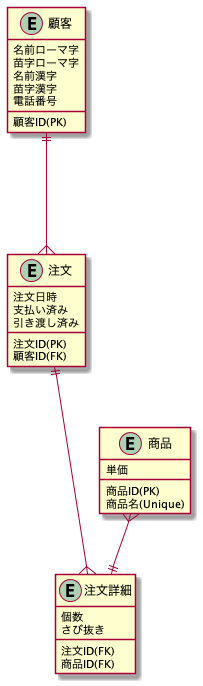
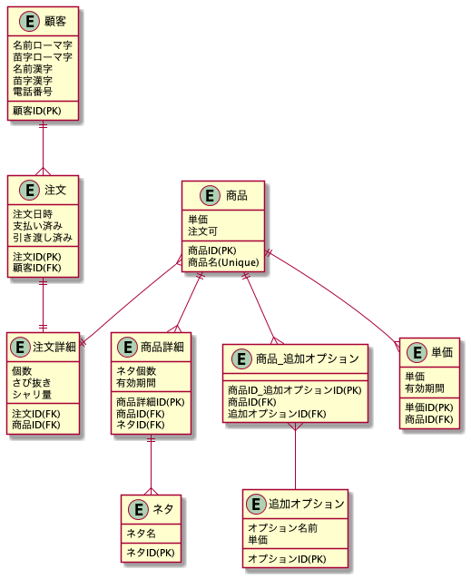
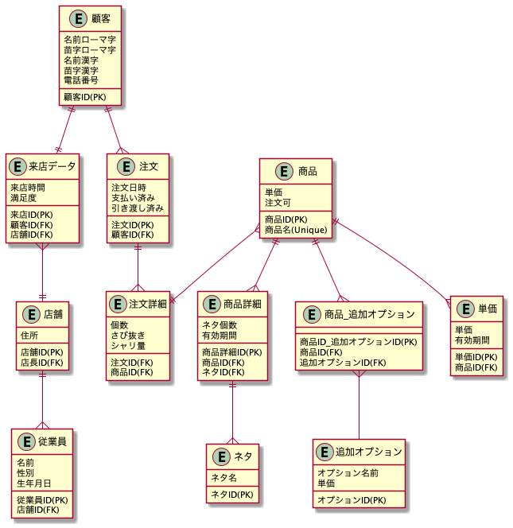

# DB モデリング 1

## **課題 1 の回答**

### ゴール(思考が追えるように変遷を記載)

まずは各顧客が出した注文と注文の内容を確認できるようにシンプルなたたき台的を作成。

- 化粧箱入り寿司八宝巻は別商品として対応
- 支払いは注文時時点と引き渡し時点のどちらかで行う前提

[追加変更点]
後から考えたら現時点で不要な観点ばかり、、、、細かく描きすぎた感がある。

1. 単価の変更があったら？(現時点で不要な観点)
   1. よくよく考えたらお好みすしは、値段毎に別れているので単価テーブルは管理しやすいかも
2. セットメニューに入っているネタが変更されたら？(現時点で不要な観点)
   1. こちらも単価と似たような形で対応。集計に影響を与えないように有効期間を設定しました。
3. 商品自体がなくなってしまったら？(現時点で不要な観点)
   1. 各商品に注文可フラグを追加しました。
4. 化粧箱などのオプションが増えたら？
   1. 追加オプションテーブルを追加して商品と関連させました。

### 考えかたポイント

1. 「セット」と「お好みすし」は一つの商品として考えています。(今の時点で項目分けがありません。)
   1. お好みすしのネタはひとつしかありません。
2. 「セットメニュー」と「お好みすし」を商品テーブルで管理するか。~~あるいはそもそも別のテーブルで管理するべきか。別管理するならば最適な方法は何があって、方法を比較したらメリット・デメリットは何か？のアイディアがない状態です。~~ 単純にカテゴリ（項目）を管理するテーブルを作って管理が楽かなと思っています。カテゴリ、サブカテゴリと細かく各商品を分けるべきかなと考えています。

例

- セットメニュー
  - 盛り込み
    - はな
    - ...
    - イサリビ
  - 地元に生まれた味
    - 鮨八宝巻
- お好みすし
  - 100 円皿
    - 玉子
  - ...
  - 600 円皿
    - うに

[任意課題]

**論理モデルとは？**

オブジェクト（エンティティ）とその属性を定義しお互いの関係性を図などで表現したもの。

**物理モデルとは？**

論理モデルで作ったエンティティ/属性に対して実際のテーブル名/カラム名/データ型などを設計し、テーブルを作成できるようにする。インデックス等の最適化などもここでこのなう。

**論理モデルと物理モデルのゴールの違い**

論理モデル: エンティティと属性を設計し関連性を定義する

物理モデル: 実際のテーブル名、カラム名や主キー、外部キー、さらにはインデックスといった実際にテーブルを生成するために必要な細部の設計をする

## 課題 2 の回答

- シャリの量 - 注文詳細に「シャリ量」を追加しました。
- ネタ毎の売り上げ量 - 課題 1 で商品詳細テーブルでネタを管理しているので集計可能です。

## 課題 3 の回答

- [ありそうな追加仕様] - 各顧客の来店回数、来店した店舗、満足度を調べて店長に報告する

追加テーブル

- 来店データテーブル
- 店舗テーブル
- 従業員テーブル

