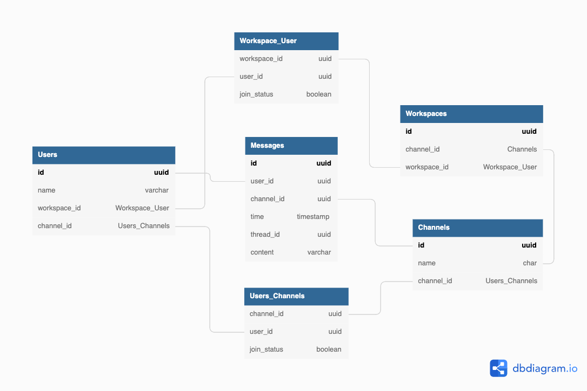

## DBモデリング2

### ポイント
1. 入会・脱退はジャンクションテーブル(Workspace_UserとUsers_Channels)のjoin_statusで管理する。初期入会時にテーブルにインサートする流れ。
2. thread_idは最初のメッセージにのみにユニークに付与され、二番目以降は最初のメッセージのthread_idが入る
3. メッセージ削除とはあくまでUI上で消えているように見えるだけで、DB上では「削除されました」とupdateが走っている
   1. 基本的に業務に関わる事実は削除しない方針です。
   