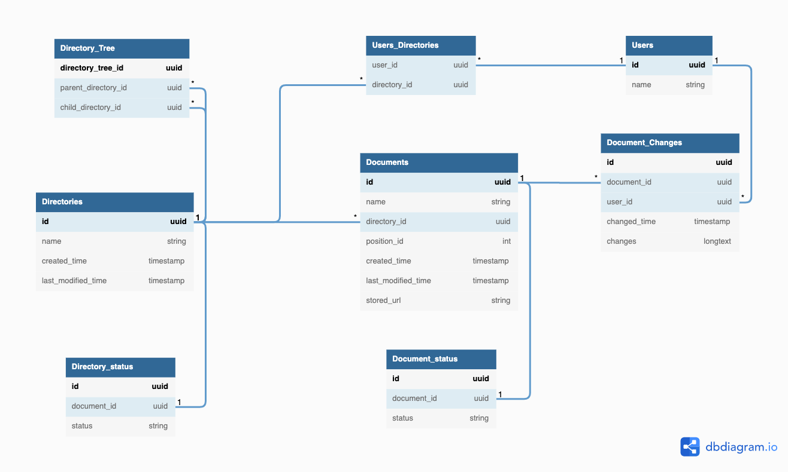

## データベースモデリング3

### 隣接リスト ver.


### 各テーブルの目的
- Users
  - 各ユーザーの情報を保持するテーブル
- Users_Directories
  - ユーザーがアクセスできるディレクトリの情報を持っておく中間テーブル
  - ユーザーとアクセスできるtop_levelディレクトリの関係性を表現する
- Directories
  - 各ディレクトリ情報を保持するテーブル
  - parent_idを持たせることで親->子ディレクトリの関係性を作ることができる
  - top_level (bool値)はホームディレクトリのような、ツリー構造を作る上で最上位のディレクトリ
    - 例えば:
      - Fugaというプロジェクトがあれば、Fugaがトップディレクトリで関連するサブディレクトリやドキュメントは全てFugaの配下になります
    - top_level == trueの場合はparent_idはnullを想定しています
- Directory_status
  - 論理削除できるようにディレクトリのステイタスを管理するためのテーブル
  - 今回の課題では物理削除でも問題ないと思います
- Documents
  - ドキュメントの各情報を持っているテーブル
    - 格納されているディレクトリ情報はdirectory_id
  - stored_urlは最新版のドキュメントが保存されているURL
- Document Changes
  - ドキュメントの更新履歴を保持しているテーブル
  - 基本的には変更点をgitのように行毎で管理する前提なので、changesをさらに別テーブルに持って変更があった各行を管理するテーブルを作るべきか？
    - あるいは、JSONのような形で各行のビフォーアフターを管理する方法もあるかなと思います。
    - とりあえずはシンプルにchangesとまとめました
- Document_status
  - 論理削除できるようにドキュメントのステイタスを管理するためのテーブル
  - 今回の課題では物理削除でも問題ないと思います

### ドキュメント順番替えについて
- ディレクトリ内のドキュメントの順番変更
  - Documentにposition_idをつけ順番を管理
    - 順番が変更すればupdateで順番を変更
    - 尚且つ、その他のドキュメントも変更が必要
    - ドキュメントが別ディレクトリに移動する度に元ディレクトリの順番を変更する必要がある
```
2番目のドキュメントが4番目にする場合の処理
1. position_id > 2 && position_id >= 4 のドキュメントのposition_idをデクリメントする 
    a. 3番目 -> 2番目
    b. 4番目 -> 3番目
2. 元々2番目だったドキュメントを4番目に書き換え(対象ドキュメントIDを指定して行う)
```
  - APIについて
    - ドラグ・アンド・ドロップでAirtableの順番を変更したところ、idとpositionのような値をpostで飛ばしていました。

### 閉包テーブル ver



- 基本的な構造は隣接リストverと変わりません
  - 大きな違いはディレクトリの構造管理に閉包テーブルを使用しているところです
- 変更点
  - Directory_Treeテーブルを追加
  - Directoriesからtop_levelとparent_idを削除
- 閉包テーブルは自己参照(自分自身をparent_id)として登録できる
  - これによりtop_level (Bool)のカラムが必要なくなる
- 閉包テーブル参照記事
  - https://qiita.com/ftsan/items/d11c47e81508b92426fb