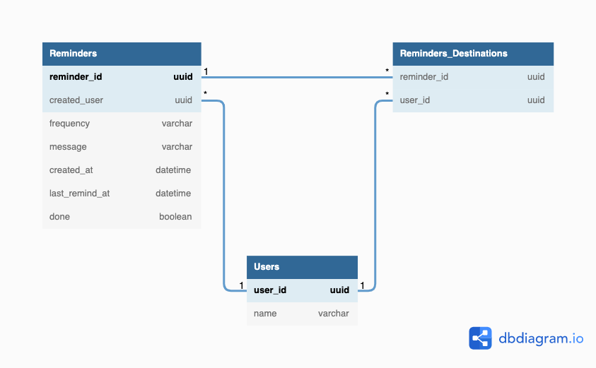

## データベースモデリング4

### 各テーブルの目的
- Users
  - Slackのユーザー情報を持っておくテーブル
- Reminders_Destinations
  - 送信先となっているUserとReminderの中間テーブル
- Reminders
  - Remindの各種情報を保存しておく
- 送信対象の抽出方法
  - 基本的にはバッチでRemindersテーブルを`WHERE done=false` で全探索
  - 全探索中にリマインドが必要なreminder_idを抽出する
  - 送信が必要なリマインドを抽出する条件
    - 毎日
      - `today - last_remind_at > 24時間`
    - X日おき
      - `today - last_remind_at > 指定された間隔`
    - 毎週X曜日
      - `last_remind_atが本日ではない && today = X曜日`
    - 毎月X日
      - `last_remind_atが本日ではない && today = X日`
  - リマインド送信後にlast_remind_atを更新する

- Remindersのfrequencyを別テーブルに分けない理由
  - テーブル結合で処理速度を落とさないため