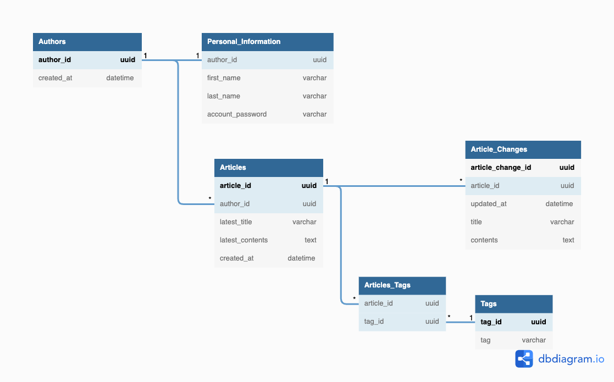
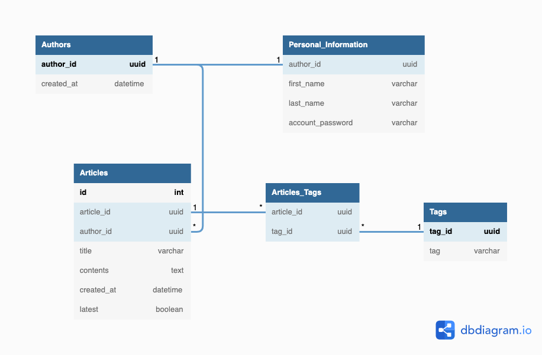

## データベースモデリング5

## 課題1

### 各テーブルの目的
- Authors
  - author_idを保有してユーザーを管理するテーブル
  - 個人情報はPersonal_Informationで管理
- Personal_Information(必須要件ではない)
  - 今回の課題的には必要がないテーブル
  - ただ、実務を考えると個人情報は別テーブルに分けて保管する
  - Authorsとは１対１の関係性を持っている 
- Articles
  - 最新状態の記事を持つテーブル
  - このテーブルには、最新状態のタイトル、記事の内容が保存されている
- Article_Changes
  - 記事の変更履歴を持つテーブル
  - 基本的にはタイトルと記事の内容が保存されている
- Tags(必須要件ではない)
  - 記事に付与するTagを管理するテーブル
- Article_Tag
  - article_idとtag_id複合主キーを作成して紐付ける
  - なぜ変更履歴(Article_Changes)と紐付けないのか
    - 変更履歴はあくまでコンテンツ自体の変更を管理する
    - タグはコンテンツが所属するカテゴリや属性の情報を付与するためにあり、これらは変更があまりないと推測

### 各要件に対して対応方法

- 記事
  - 1000文字程度の本文を記入して保存できる
    - latest_contentsはtext型を持たせた
    - 使用するDBMSに依存するが、65,535バイト分の情報を保持できる
- 記事の履歴
  - 記事を更新すると履歴が保存される
    - 記事を更新するとArticle_Changesに新たなレコードをInsertする
  - 特定の記事の履歴を一覧表示できる
    - Article_Changesからarticle_idを条件に抽出可能
  - 履歴を選択して過去の記事状態に戻す事が可能
    - Article_Changesから戻したい過去の記事を抽出してArticlesのlatest_titleとlatest_contentsを書き換える
    - 書き換えた後に戻した記事以降に書かれた記事を物理削除する
      - 論理削除して一定期間保存後物理削除するアプローチもできると思う
- 記事の閲覧
  - 最新状態の記事を一覧表示できる
    - Articlesを使えば一覧表示できる

## 課題2
- 履歴データを分析のみの用途でも保存する必要があるのか？
  -  直感的には履歴データはあって困らないかなと思う
  -  分析の目的によるのかなと。分析にするにしても必要な項目のみに絞れば全てを保存する必要はない
  -  変更点を時系列で確認する分析なら変更履歴は必要？

### 履歴データ 別アプローチ

- まずは履歴データについてリサーチ
  - 2つのアプローチがある
    - 一つのテーブルで管理するアプローチ
    - 履歴管理用のテーブルを作り管理する
      - 課題1ではこっちを使って設計
  - イミュータブルデータモデルを勉強する
    - 自分の浅い理解だと更新(Update)を極力しないように設計する方法論

- 勉強に使った記事
  - https://qiita.com/ak-ymst/items/2e8e92f212c807bb09a1
  - https://qiita.com/takanemu/items/d9c52811d70d37b232a9
  - https://user-first.ikyu.co.jp/entry/history-table

## 変更履歴テーブル無しバージョン

### 概要
- 変更を新しいトランザクションと見立ててArticlesテーブルにInsertする
- 最新版を把握するためにlatestというカラムを作り把握できるようにした
  -  Boolean型になっているがintでもいいかも
  -  あるいは、timestampで判断する
  
### 各要件に対して対応方法

- 記事を更新すると履歴が保存される
  - 新しいレコードをArticlesにInsertする
- 特定の記事の履歴を一覧表示できる
  - articles_idで抽出する
- 履歴を選択して過去の記事状態に戻す事が可能
  - 特定の履歴を抽出して、それ以降を物理削除
- 最新状態の記事を一覧表示できる
  - latestで最新状態の記事を抽出する

### 変更履歴テーブルあり•なしのメリット・デメリット
- あり
  - メリット
    - テーブルが綺麗に分かれていて見やすい
    - 最新記事一覧表示と履歴一覧表示のクエリを分けられる
  - デメリット
    - ArticlesとArticles_Changesで同じデータを保有している
    - テーブルが分かれているのでクエリを書く時に複雑と感じる人もいるかも
- なし
  - メリット
    - テーブルが一つなのでわかりやすい
  - デメリット
    - アクセスがArticlesに集中する
