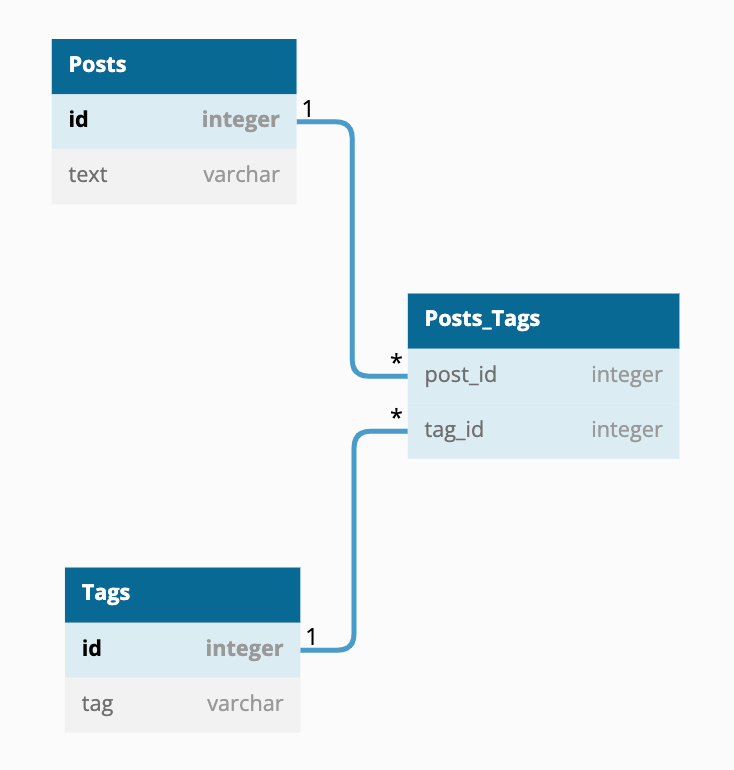

# データベース設計のアンチパターンを学ぶ1

## 課題1
この設計から生じる問題は何か？

- 文字列のバリデーションをアプリケーション側で行う必要がある
  - タグではないと思われる文字列をアプリケーションで判断して排除する必要がある
- [再現不可できない?]タグの階層を作成するのが文字列のみで表現するのが適さない
  - 料理 > スープ (上位タグ、上位タグに含まれる下位タグなどの階層)
  - 正しく上位タグと下位タグが置かれているかDBからは制御できない
    - 文字列のため、スープ > 料理 となってしまう可能性
- というかこれは第１正規化に違反するのでは？
  - 各列の値は各集合から1つ選択するの対して、これは複数の値が選択可能
- varcharの最大長以上にtagを入れることができない
  - 大量のタグに対応ができない
  - 何万もタグが付くか分かりませんが
- ユースケースとして実際に使われるか分かりませんが、タグのソート
  - DB側では文字列のソートはできない

SQLアンチパターンから 
1. 等価性による比較ができなくなりパターンマッチが必要になる
2. カンマ区切りのリストの値を使ってJOINは煩雑になる
3. 集約クエリが使いづらくなる
4. 入力される文字の妥当性が検証できない
5. タグ自体に区切り文字が入っていたら？
6. リストの長さに制限が入る

## 課題2
交差テーブルを作成し各PostとTagを紐付ける

## 課題3
- IoT機器に接続して測定を行うセンサーの測定機能
- 例: オムロン 環境センサ(USBタイプ) 2JCIE-BU01
- 測定機能：温度、湿度、照度、気圧、騒音、3軸加速度 *1、eTVOC
- 一つのセンサーで複数の項目を測定可能なため、「Sensor」テーブルに「Measure」カラムを追加しカンマ区切りで項目を記述してアンチパターンにどハマり。。

