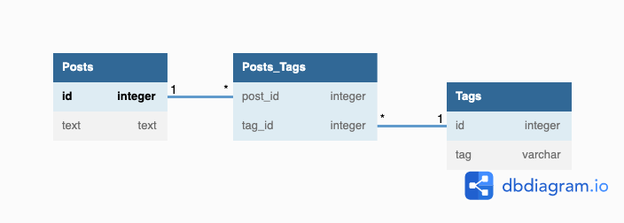

## データベース設計のアンチパターンを学ぶ2 

### 課題1
これはマルチカラムアトリビュートのアンチパターン

1. 検索時にどのカラム(tag1Id ~ tag3Id)に目的の値が入っているか分からないので3行全てに検索をかける
2. カラムから値の追加と削除は事前に対象の行に入っている値を確認する必要がある
3. 一意性の保証がない
   1.tag1Idとtag2Idに同じ値が入る可能性がありDB側では制御できない 
4. 増加する値に処理にカラムを拡張する必要がある
   1. tag4Id、tag5Idと増えた場合にはカラムを追加する必要がある

### 課題2
解決策: 従属テーブルを作成し属性を格納する。属性値を複数の列格納するのはなく、複数の行に格納する。
変更: 従属テーブルから交差テーブルへ変更。

ジェイウォークとマルチカラムアトリビュートの同じ点・違う点
- 同じ点
  - 複数の値を持つ可能性がある属性を格納する
- 違う点 
  - ジェイウォークは多対多の関連性
  - マルチカラムアトリビュートは1対多の関連性

### 課題3
このアンチパターンに陥りそうなケース・シナリオ

各店舗に対して計測センサーを置く予定だが、
当初３台設置する予定だったのでカラムを3つ作成したが、
後ほど追加が入りカラムを拡張するハメになった。