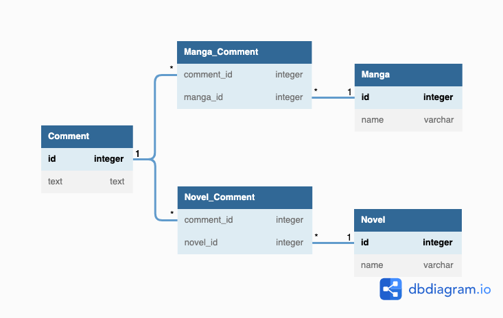
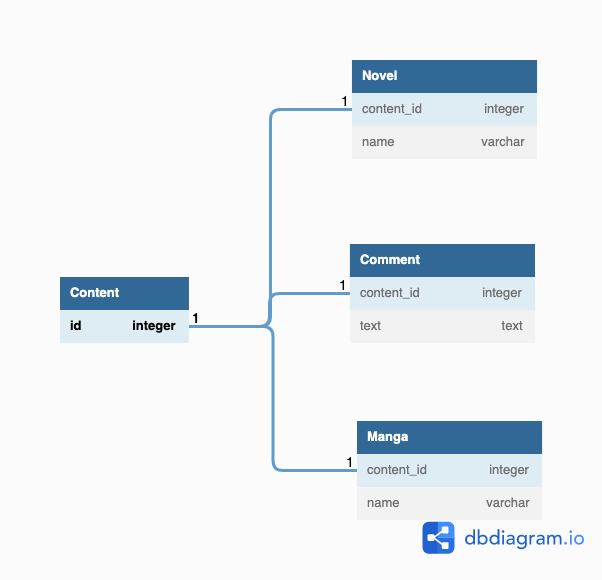

## データベース設計のアンチパターンを学ぶ3

### 課題1
ポリモーフィック関連のアンチパターン
- 問題点
  - `belongs_to_id`が複数のテーブルに対して参照しているため外部キー制約による参照生合成を捨てている
  - つまり、belongs_to_idに`Manga.id`でも`Novel.id`でもない値を入れることが可能

### 課題2

#### 解決策1: 交差テーブルを作成する

#### 解決策2: 共通の親テーブルを作成する

### 課題3
どんなサービスを開発している時に上記のようなアンチパターンに陥りそうでしょうか？
最低でも1つは例を考えてみてください

- 例_1 (ガチガチに仮定している例)
  - 仮定_1: 資格試験の勉強サービスを提供している (資格の学校TACみたいな)
  - 仮定_2: 生徒は複数の受講形式を選択でき、形式ごとに受講料金が違う
    - 録画コンテンツ
    - オンラインのライブ授業
    - 対面授業
  - 仮定_3: 資格によっては提供していない形式もある
    - 例えば、IT資格はオンライン授業と録画コンテンツのみ
  - 仮定_4: 形式ごとにテーブルがあり、その中に対象資格に関する情報がある
  - 結論: Studentテーブルは`format_id`と`format_type`というカラムを持って参照している
  
- 例_2 (もうちょっと現実に即している？例)
  - 仮定_1: 観光地レビューサービスを提供
  - 仮定_2: 各国の有名観光地の情報を国ごとにテーブルを分けて管理している
  - 仮定_3: レビューを投稿する`Review`テーブルでは`country`と`location_id`のカラムがある
    - `country`はどの国かを管理
    - `location_id`は、対象国の観光地に振られたID