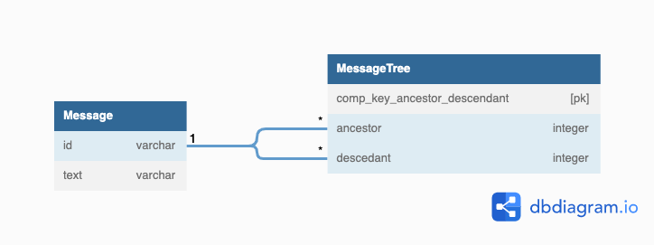

## データベース設計のアンチパターンを学ぶ4

### 課題1

#### この設計だとどのような問題が生じるか、説明してください
- 現在の隣接リストになっている(常に親のみに依存する)
- 隣接リストの問題点
  - SQLを書く際にJOINの数を固定しなくてはならない。階層が深いツリーに対応することが現実的ではない。
- ツリーのメンテナンス
  - ノードの追加と移動をするクエリは複雑ではない
  - しかし、ノード削除は難しい
    - サブツリー全体を削除したい場合、すべての子孫を特定するクエリを実行し、その後外部キーの整合性制約を満たすために最下層から順番に子孫を削除する必要がある
    - ON DELETE CASCADEを使って自動化できるが、あくまで削除のみでノードの昇格や移動はできない

以上から、メンテナンスが難しいモデルです。

### 課題2
- 解決策は3つある
1. 経路列挙モデル - 先祖の系譜を表す文字列を各ノードの属性として格納する
2. 入れ子集合モデル - 直近の親ではなく、子孫の集合に関する情報を各ノードに格納
3. 閉包テーブルモデル - 直接の親子関係だけでなく、ツリー全体のパスを格納する

閉包テーブルを採用する。理由は、
1. 参照整合性制約があること(経路列挙と入れ子集合にはない)
2. 交差テーブルに慣れているのでメンタルモデルが構築されやすい

### 課題3

#### アンチパターンに陥りそうなケース

- 例: 家系図作成を提供しているサービス(https://www.familysearch.org/ja/)