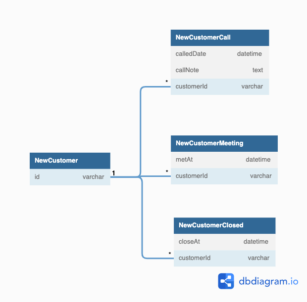

## データベース設計のアンチパターンを学ぶ5

### 課題1

アンチパターン: メタデータドリブル
- 問題点
  - 例えば商談の数が増えたらどうなるでしょうか？
    - metTwiceなど、カラムを追加して対応する
  - 仮に面談を3回実施して、1回目の面談日時を知りたい時はどうすれば良いのでしょうか？
    - metThirdAtカラムを追加して面談日時を記録する
  - 例えば一度成約した後に解約し、後にまた同じ人が成約したらどうなるでしょうか？
    - 再成約ごどにカラムを作りる(closed_2, closed_3)

問題点 - SQLアンチパターンから(どちらかというとテーブルに該当):
1. テーブル(あるいはカラム)の増殖
2. データの整合性を維持する
3. データの同期
4. データの一意性の保証(カラムを分けた場合は問題ないかも)
5. テーブルを跨いだクエリの実行
6. メタデータの同期
7. 参照整合性の管理

つまり、カラムあるいはテーブルがどんどん増えていって管理が煩雑になるアンチパターン

### 課題2 解決策

SQLアンチパターンによると解決策は3つある
1. 水平パーティション - 行を分割する
2. 垂直パーティション - 列でテーブルを分割する
3. 従属テーブルの導入

今回は#3の従属テーブルを選択しました。

### 課題3 アンチパターンに陥りそうな例
どんなサービスを開発している時に上記のようなアンチパターンに陥りそうでしょうか？
- カラムが増加しない前提で設計していたが、そうならなかった場合
- パフォーマンスが足らず、そのためにテーブルや列を開発者が分割する

