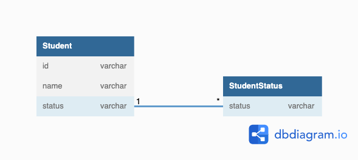

## データベース設計のアンチパターンを学ぶ6

### 課題1

上記の設計だとどのような問題が生じるか、説明してください。
 
アンチパターン: サーティワンフレーバー
- 生じる問題
  - ENUMやCHECK制約を追加あるいは削除するための構文はないので新たな値セットで列を定義する
  - とある値を廃止した場合は、廃止値を参照してる行をそのままにしておくリスク
  - 各種データベースによって仕様が異なるので移植が困難

### 課題2

- 解決策
  - 参照テーブルを作成し参照する値を行に挿入する

### 課題3
- 例: サッカーの配券システムをモデリングした場合に使用する試合項目
  - ホームゲーム、交流試合、アウェイゲーム等
  - すべての試合項目を網羅していると考えていたのでENUMとCHECK制約を使っていた
