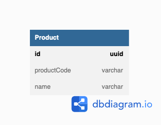

## データベース設計のアンチパターンを学ぶ8

### 課題1
どのような問題が起きるのか

- 整合性が取れないケースが出現する可能性がある
  - 従来の形式と違う形でDBに登録されたりするリスクがある
  - 商品コードはあくまで業務的に使用するものであり、寿命が短い可能性がある
    - であればシステム的には寿命が長いコード体系と紐付けておく事で変更に強くなる
- 商品コードがないとDBに登録することができない
- 項目別(Aの商品、Bの商品)に分けられていないので項目で抽出したい場合は文字列検索(正規表現)が必要になる
  - インデックスのメリットを得ることができない(毎回フルスキャンになる)

### 課題2
どのような主キーを設定すれば解決できるか
#### 代理キー(サロゲートキー)を利用する

### 課題3
- 過去のコードが使い回されているケース
  - ISBN (https://togetter.com/li/1053696)
