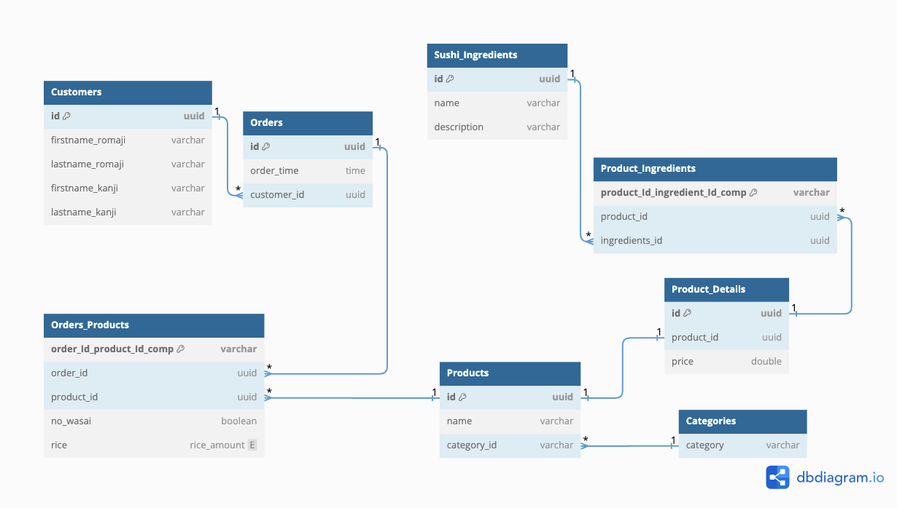
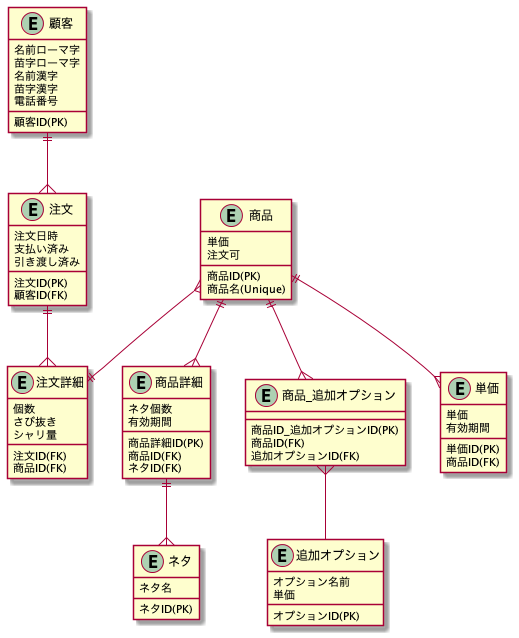
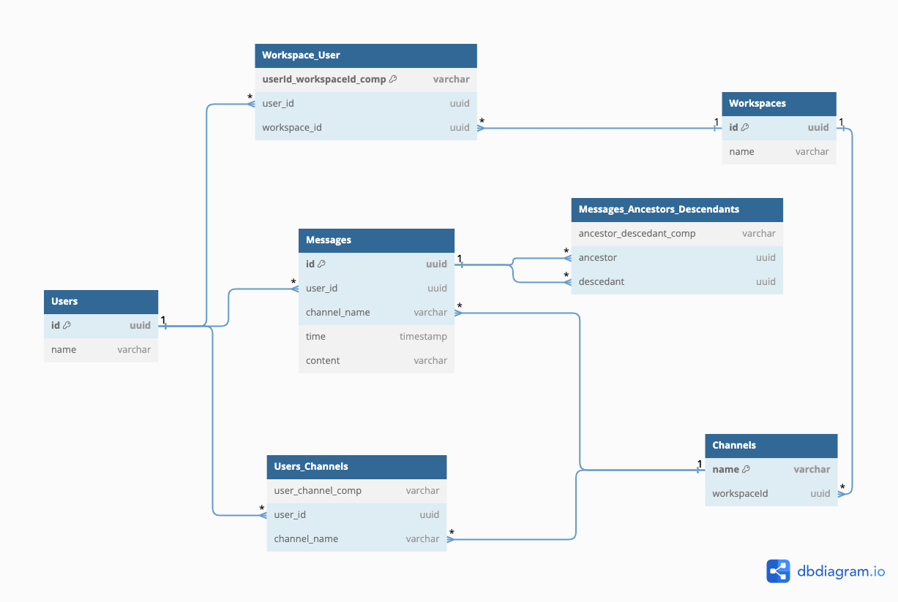
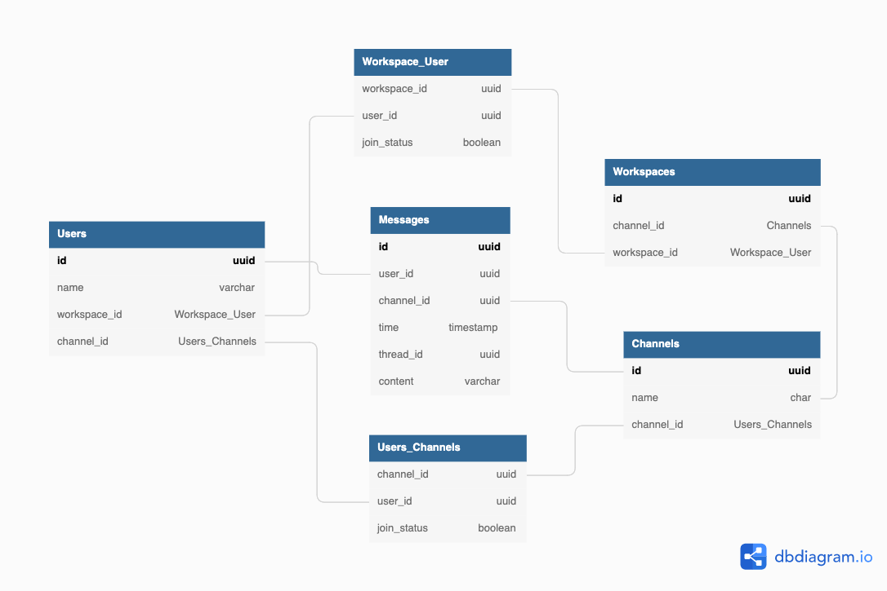
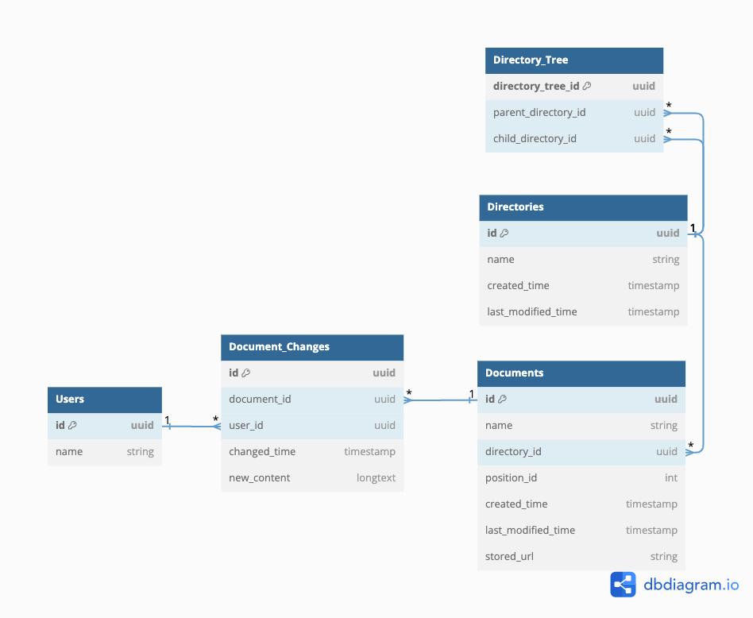
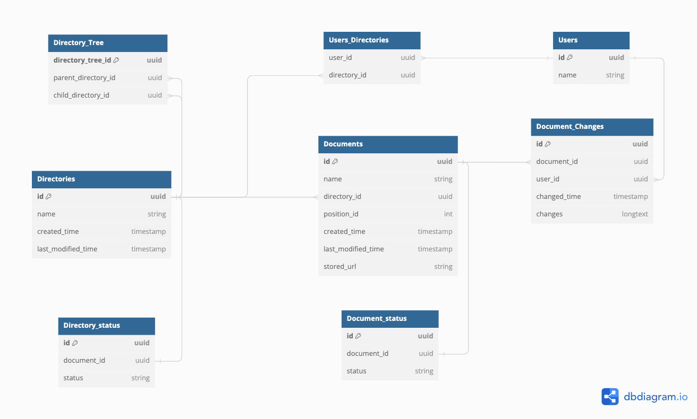
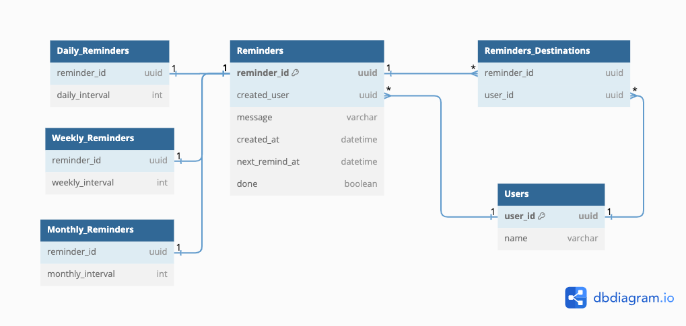
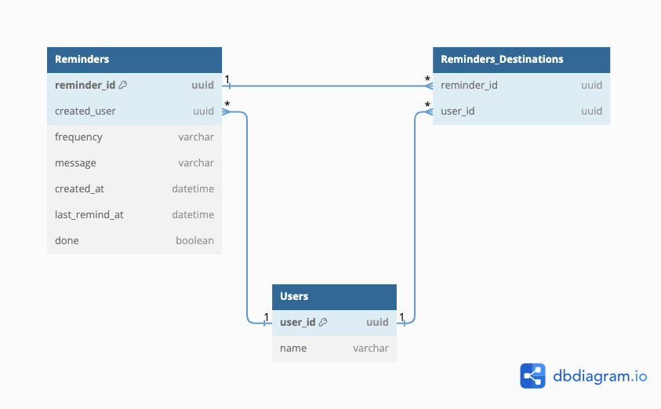
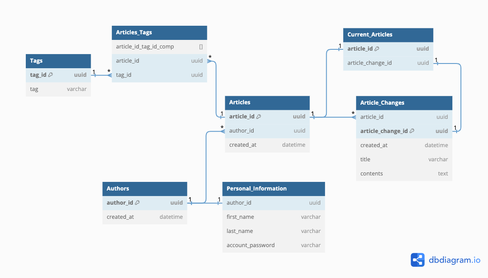
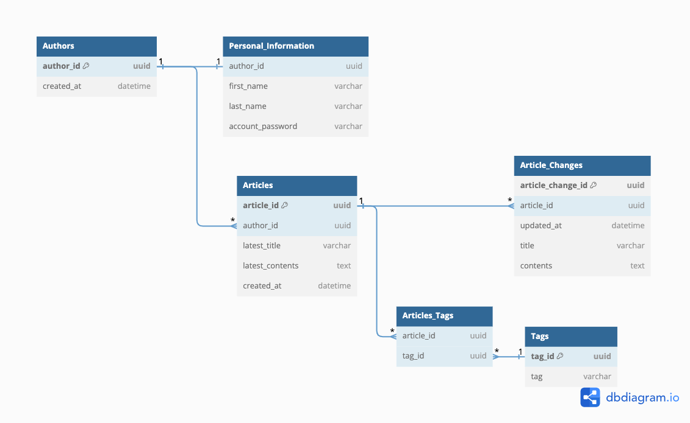

## アンチパターンを踏まえてDBモデリングを見直そう

### 課題1: DBモデリング1~5を振り返って課題で作成したモデルを修正する

#### DBモデリング1

変更ポイント
   - OrdersとProductsの間に交差テーブルを追加
     - 1つの注文は1個以上の商品を購入し、商品が複数の注文にまたがることがあるため
   - Product_DetailsとSushi_Ingredientsの間に交差テーブルを追加
     - Product_Details(特にセット系)は複数のネタを使用し、ネタが複数の商品にまたがることがある(マグロの赤身が複数の商品で使われるなど)
   - IDリクワイアドを修正
   - Categoriesテーブルを追加して各寿司のカテゴリを管理

変更後(変更点に対して関連性の低いテーブルは割愛してあります)

変更前

#### DBモデリング2
変更ポイント
   - スレッドをナイーブツリーを使って表現
     - 構造は隣接リストだが閉包テーブルを使って表現(少しオーバーエンジニアリング気味)
   - IDリクワイアドを修正
   - 変更理由:
     - 閉包テーブルに変更した理由はツリーを表現するためです

変更後

変更前

#### DBモデリング3
変更ポイント
  - IDリクワイアドを修正
  - 論理削除のためのDocument_statusとDirectory_statusを削除
  - User_Directoryを削除しシンプルにしました -> ディレクトリの作成者・変更者の情報は保持する要件は無いため

変更後

変更前

#### DBモデリング4
変更ポイント
  - Remindersを継承クラステーブルに変更
  - 変更理由: 次のリマインドをするinterval(期間)の制約が、日、週、月ごとに違うため、テーブルを分けてCheck制約として管理するため
    - 例: 週 -> 0 (月) - 6 (土)
    - 例: 月の場合 -> 1 ~ 30 or 31
    - アプリケーション側にバリデーション(値の制約)を持たせるのであれば、この設計は必要ないが、データの質はデータベースが管理するべきと考える
  - next_remind_atを更新する際は、Daily_Reminders、Weekly_Reminders、Monthly_Remindersをreminder_idで検索し結果をUNIONする。UNIONで得られた結果をnext_remind_atの更新に使用する。
    - 理由: どのテーブルがinterval(期間)を持っているか分からないため

変更後

変更前

#### DBモデリング5
変更ポイント
  - Current_Articlesを追加しArticlesとArticle_Changesを紐付け

変更後

変更前

