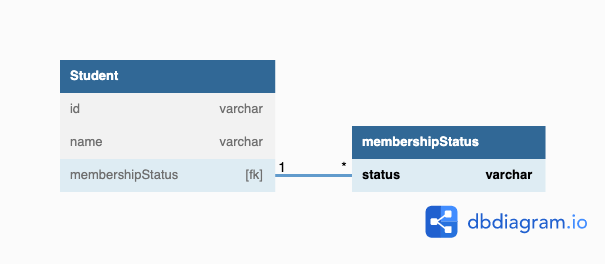
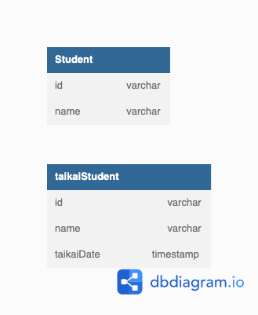

## データベース設計のアンチパターンを学ぶ7

### 課題1

「とりあえず削除フラグ」の問題点

なぜ出てくるのか？
1. 元に戻せなくなるのが怖い
2. 削除したデータを検索対象に入れたい
3. ログとしての用途
4. 誤操作をすぐに戻したい

[参考記事](https://qiita.com/smith-30/items/3b50b82be6eda95b07d0#%E8%AB%96%E7%90%86%E5%89%8A%E9%99%A4%E3%81%AF%E3%82%A2%E3%83%B3%E3%83%81%E3%83%91%E3%82%BF%E3%83%BC%E3%83%B3)

デメリット
1. 全てのSQL文のWHERE句に削除フラグが必ず入る
2. 削除フラグも含めたユニーク制約も必要になってくる。できていないとセレクトした時に2件引っ掛かるパターンが出てくる 
   1. そうなるとLIMIT 1などが蔓延していく

解決策(論理削除というのは世の中にない)
1. 状態遷移として捉える
   1. 社員の例であれば入社・退社などのステータスでモデリングする
2. 履歴テーブル
   1. ユーザーには見せたくないがDBには存在する
   2. ログとして残したい
   3. 現役のデータが入っているテーブルと削除済みのテーブルを作る
      1. UsersテーブルとDeleted_Usersテーブルを作る
      2. Usersテーブルから物理削除した後にDeleted_Usersにインサートする
      3. トリガーを使用してDeleteが走ったらインサートされるようにする
      4. 削除データが現役データより多い場合に検索に時間がかかる可能性があるので、テーブルを別に分けて検索を楽にする
3. 削除も更新もしない
   1. 企業活動において何かを消すことはない
   2. インサートしかしない
   3. T字系ER手法 - データに状態を持たせない
      1. データが増えるならお金をかける
      2. 現役のデータをとてくるときは常にorderbyする必要がある
      3. エンタープライズならいいがwebなら辛いところが出てくる
   4. イミュータブルデータモデルを使う

誤った操作をなかったことにしたい、という課題はまだ解けていない

### 課題2

解決策1: 状態として持たせる(入会/退会などのステートで管理する)

解決策2: 履歴テーブルとして扱う
- 退会時Studentからは物理削除するが、トリガーを使用しtaikaiStudentにインサートする
- 履歴としてデータを残すことは可能になる
- トリガーを使用するので運用でコストを払う必要がある
  - ドキュメントの維持など

### 課題3
- ECサイト(Orderテーブルから対象の注文をid指定で削除する機能を実装した)
  - Orderテーブルを参照しているテーブルにはデータが残っている可能性があり整合性が取れなくなる
    - 参照しているテーブルからデータを削除することが必要
    - あるいは`CASCADE DELETE`を使って削除する
  - 業務的には注文をキャンセルしたということなので履歴を残す必要性があるがデータ自体が存在しない
    - 顧客が間違って操作した場合に苦情が来たがデータがないので対応できない
- 学習塾の進捗管理サービス
  - 生徒が再入会した場合に、その生徒に関連するデータがなけばどこまで進捗があったかわからなくなる
    - ゼロからスタートする必要がある
- 自分が過去に開発したサービス
  - 以前作成したことがある写真投稿機能があるスマホアプリがあります。
  - ユーザーが退会した時にはアップロードしたすべての写真を削除するようにしましたが、ユーザーデータ含め、アーカイブの方が、再開することができる
