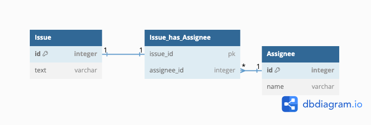

## データベースにおけるNULLの扱い

### 課題1

```
SQLクエリで以下の式を実行した時の結果を答えてください
SELECT NULL = 0;
NULL = NULL (以下、SELECT部分を省略)
NULL <> NULL
NULL AND TRUE
NULL AND FALSE
NULL OR TRUE
NULL IS NULL
NULL IS NOT NULL
```

- SELECT NULL = 0;
  - `NULL`
- SELECT NULL = NULL;
  - `NULL`
- NULL <> NULL
  - `NULL`
- NULL AND TRUE
  - `NULL`
- NULL AND FALSE
  - 0
- NULL OR TRUE
  - 1
- NULL IS NULL
  - 1
- NULL IS NOT NULL
  - 0


### 課題2

```
テーブル設計を見直して、Issueテーブルが null を含まないように作り変えてください
```

```
回答: 交差テーブルを作りIssueテーブルと、Assigneeテーブルを紐付ける。
AssigneeがあるIssueのみをこの交差テーブルに挿入する。
```



```
NULLがデータベースに存在することは本当に悪いことなのか？トリオで議論する。
```

### 課題3

```
NULLになり得るカラム全てにNOT NULL制約を付与しない方が良い理由
```

```
回答:

Null値とDefault値は前提が違うものです。
Nullは存在しない(値がない)を意味し、Default値は何かしらの値があるという前提に立ちカラムに対して値を与えます。
そのためNullの方がデータ表現が適切な場合があります。

例えば、Userテーブルがあり、
ユーザー作成時にEmailがオプションとして入力可能であるとします。

Emailが入力されていない場合、最適なdefault値はなんでしょうか？
"default@example.com"や空文字列も考えられますが、
データが存在しないので、Nullの方が適切です。

逆にUserのログイン回数を表すカラムにはNullを使うよりも、
default値(この場合は0)を与えてあげるとわかりやすいです。

要は一方に偏るよりも使い分けが重要になってくると思います。
```
上の例はデータ表現から説明しましたが、自動でNullを算出から排除してくれることもあり、クエリがシンプルになります。
- NullだとAVG(平均)の計算から自動的に排除されるが、デフォルト値だと結果を偏らせる[ケース](https://www.ibm.com/docs/en/db2-for-zos/12?topic=columns-when-use-null-default-values)

### 課題4

```
データベースにおける「NULL」に関するクイズを作成すること
```

