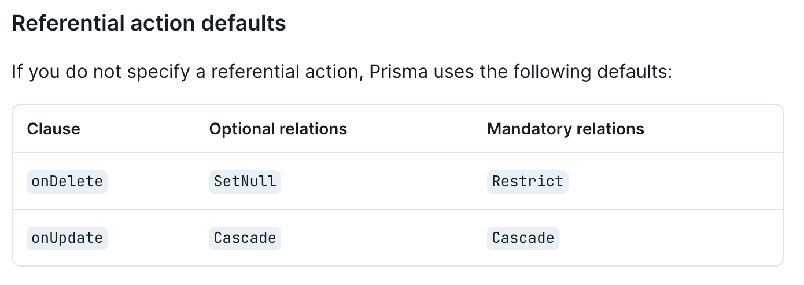

## 外部キー制約について考える

### 課題1

```
親子関係にあるデータに外部キー制約を一切定義しないとどのような問題が起き得るでしょうか？
AuthorテーブルのidカラムがBookテーブルに紐づいている場合
```
外部キー制約を定義しなかった場合、参照整合性がないため以下のエラーを検知することができない
- 存在しない値をauthor_idに挿入する
- 関連付いた行を消そうとする

```
逆に外部キー制約を定義することでどのような問題が起き得るでしょうか？
```
関連するデータを作成・更新・削除しようとした際に関連するレコードの管理が面倒になる

#### 外部キー制約を使用する・しないタイミングとは？
概要: 強い整合性には外部キーを使用し、弱い整合性(結果整合性)では外部キーは必ずしも使う必要はない

```
強い整合性 - 作成・更新・削除を行うときに関連テーブルも同時に行う必要がある整合性
弱い整合性 - 関連するテーブル同士のライフサイクルが違うため外部キーを適用できない
```

参考記事: [外部キー制約は何も考えずに適用するとよくない](https://blog.j5ik2o.me/entry/2020/06/16/105311)

参考記事: [外部キー制約が一切ないと何に困るのか？](https://zenn.dev/praha/articles/2667cbb1ab7233?redirected=1)

参考記事①の例を自分の言葉で要約します。
```
売上テーブルと売上詳細テーブルは、作成・更新・削除を概念的に個別で行わせることはない。
片方に変更があれば、もう片方も同じく変更が入る。この二つを分けて考えることはできない。
-> 強い整合性

一方で商品テーブルは、売上が作成された時点では商品は存在するが、
将来的に商品はなくなってしまう可能性があり、売上とライフサイクルが同じでない。
-> 弱い整合性
```
外部制約を適用すると、商品が廃盤になった際に物理削除ができない。もちろん論理削除で対応もできる。

結論: ライフサイクルが違う二つのテーブルは弱い整合性があり外部キーを必要としない

### 課題2

#### MYSQLで選択可能な参照アクションと、それぞれのアクションを選択すべきケースを挙げる

```
RESTRICT
親テーブルに対して削除・更新操作を行った際に、対象の行が参照されていれば操作を拒否する

例: 親テーブルの対象データを参照している場合は更新・削除をさせたくない。本を執筆したことのある著者を間違って削除したくない。つまりAuthorには登録されているが、執筆実績(Bookから参照されていない)がなければ削除できるようにしたい。
```

```
CASCADE
親テーブルに対して削除・更新を行うと、子テーブルを自動的に更新または削除する(追従する)

例: 親テーブルAuthorを削除、あるいはauthor_idを更新した際に子テーブルのBookも同様に削除・更新する
```

```
SET NULL
親テーブルから行を削除・更新し、子テーブルにの外部キーカラムをNULLに設定する

例: 親テーブルからデータが削除され、子テーブルの外部キーが挿入されているところをNULLにする。
顧客IDが削除された際に、売上テーブルの対象顧客IDをNULLにする(実際に物理削除するかは別)
```
  
```
NO ACTION
MYSQLでは、RESTRICTと同様、親テーブルに対する削除・更新操作を拒否する

例: RESTRICTと同じユースケース
```
レファレンス - [1.7.3.2 FOREIGN KEY の制約](https://dev.mysql.com/doc/refman/8.0/ja/constraint-foreign-key.html)

#### ユースケースに対して適切な参照アクションを選択する

```
従業員管理サービスを例に考えてみます。従業員（Employeeテーブルがあるとします）は必ず部署（Departmentテーブルがあるとします）に所属していなければいけないとします。Employeeテーブルにはdepartment_idカラムが含まれていて、on delete cascadeが設定されています。このケースにはどのような問題が潜んでいるでしょうか？
```

```
回答: on delete cascadeが、Employeeテーブルのdepartment_idにセットされている場合、特定のdepartment_idが削除されたら、所属している従業員も削除されます。これがレイオフなどのケースで部門ごと無くなってしまうなら問題がないが、従業員が引き続き特定の部門に所属しているなら、先ず従業員のdepartment_idの更新を優先すべきと思います。

ON SET NULLを使用して、department_idに対してnull値を与えるか、あるいはRESTRICTで手違い削除を避ける。
```

```
プロジェクトマネジメントツールを例に考えてみます。このサービスでは案件（Issueテーブルがあるとします）には必ず担当者（Assigneeテーブルがあるとします）が任命されなければならず、担当者が任命されていないIssueが存在することはサービスの性質上、一切許容されません。Issueテーブルにはassignee_idカラムが含まれていて、on delete set nullが設定されていました。このケースにはどのような問題が潜んでいるでしょうか？
```

```
回答: assignee_idに対して、on delete set nullが設定されているのであれば、担当者が削除されれば、null値がassignee_idに入る(更新される)。
これはサービス要件を満たしていない。RESTRICTを使用して、エラーを返すことで、issueに担当者がアサインされていない状態を避けられる。
```

#### ORMの参照アクションのデフォルト値の違いを調査する

[PRISMA](https://www.prisma.io/docs/concepts/components/prisma-schema/relations/referential-actions)
- 子テーブルの外部キーのカラムがnullableならOptional relationになる


[Sequelize](https://sequelize.org/docs/v6/core-concepts/assocs/)
- オプションとして参照アクションを引き渡して設定できる。
- デフォルト設定([参照](https://github.com/sequelize/sequelize/blob/f1f2ba048f1f51a0affb4f6ce41335da08acd3b3/packages/core/src/associations/base.ts#L17))
  - one-to-oneと、one-to-manyなら、ON DELETEはSET NULLで、ON UPDATEはCASCADE([ここ](https://sequelize.org/docs/v6/core-concepts/assocs/#ondelete-and-onupdate))
  - many-to-manyは、ON UPDATEとON DELETEの両方がCASCADEになる([ここ](https://sequelize.org/docs/v6/core-concepts/assocs/#options-2))
  - 過去にすべてのAssociation(関係性)のデフォルト値を変更できるようにするIssueが上がったが、[取り合ってもらえなかった](https://github.com/sequelize/sequelize/issues/10824)

- 値が選択されている理由を考察

  - UPDATEがCASCADEになっている -> 親テーブルが更新された場合、子テーブルも更新する (理解しやすい)
  - DELETEのデフォルトは、SET NULL -> ORMは各テーブルのライフサイクル違いを認識しないため、NULLを与えてなるべくデータを残そうとしているのでは？
    - Sequelizeのmany-to-manyのデフォルトがCASCADE ->  SET NULLだとJOINテーブルをNULLに更新する。それではテーブル間の繋がりを保てていないので、CASCADEで削除する

#### MySQLとPostgreSQLのrestrictとno actionの違いを調査する

- MySQL
  - `RESTRICT`と`NO ACTION`は同じ
- PostgreSQL
  - `RESTRICT`は制約チェックを即時に実行
  - `NO ACTION`は外部キー制約のチェックを遅延できる(DEFERRABLEを設定してあれば)
    - 制約にDEFERABLEが設定されると、トランザクション終了時(コミット時)までチェックを遅延できる
    - この[記事](httpss://plaza.rakuten.co.jp/gontata/diary/200806100000/)がわかりやすいです。

### 課題3

#### 外部キー制約に関するクイズを3問作成してみてください

1. 質問1: 外部キー制約が一切ないと何が困るのか？ PlanetScaleを例に調査してみたください。
2. 質問2: 外部キー制約を使用していないときに出現するアンチパターンを列挙してください。
3. 質問3: PostgreSQLで、下記3つの制約に付与される性質について調べてください。
   1. DEFERRABLE INITIALLY DEFERRED
   2. DEFERRABLE INITIALLY IMMEDIATE
   3. NOT DEFERRABLE